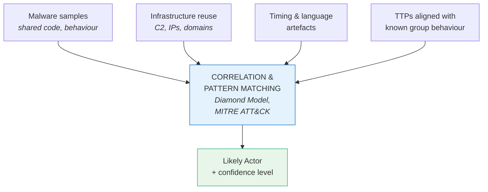

# Threat Actor Landscape

Reference for categorising threat actors, understanding their motivations and capabilities, and attributing observed activity.

For modelling adversary behaviour see [02_THREAT_MODELLING_FRAMEWORKS.md](./02_THREAT_MODELLING_FRAMEWORKS.md). For navigation see [00_INTRODUCTION.md](./00_INTRODUCTION.md).

## The Four Main Threat Actor Types

```
   ┌────────────────┬──────────────────┬──────────────────┬────────────────────┐
   │   ACTOR        │   MOTIVATION     │   CAPABILITIES   │   EXAMPLE          │
   ├────────────────┼──────────────────┼──────────────────┼────────────────────┤
   │ Nation State   │ Geopolitical:    │ Highly resourced,│ APT29 / Cozy Bear  │
   │                │ espionage,       │ patient, precise │ (Russia-linked) —  │
   │                │ disruption,      │ — strategic,     │ targets diplomatic │
   │                │ destabilisation  │ long-term        │ & research orgs    │
   ├────────────────┼──────────────────┼──────────────────┼────────────────────┤
   │ Cybercriminal  │ Profit:          │ Quick,           │ LockBit, BlackCat  │
   │                │ ransomware,      │ opportunistic,   │ — Ransomware-as-a- │
   │                │ stolen cards,    │ loosely          │ Service gangs;     │
   │                │ access sales     │ affiliated       │ target = anyone    │
   │                │                  │                  │ who can pay        │
   ├────────────────┼──────────────────┼──────────────────┼────────────────────┤
   │ Hacktivist     │ Ideology:        │ Decentralised,   │ Anonymous —        │
   │                │ political /      │ unpredictable,   │ tricky to          │
   │                │ social protest,  │ media-driven     │ attribute due to   │
   │                │ "send a message" │                  │ loose structure    │
   ├────────────────┼──────────────────┼──────────────────┼────────────────────┤
   │ Insider        │ Revenge,         │ Already have     │ Disgruntled        │
   │                │ negligence,      │ legitimate       │ employee leaking   │
   │                │ accidental       │ access — among   │ data; staff member │
   │                │ vulnerability    │ the most         │ ignoring policy    │
   │                │                  │ dangerous        │                    │
   └────────────────┴──────────────────┴──────────────────┴────────────────────┘
```

## Attribution Methodologies

Once the type of actor is identified, the next challenge is attribution — determining **who** is behind the attack. Attribution is rarely about finding a face and a name; it relies on correlating evidence to assess the likely actor.



## Confidence Levels

Attribution is rarely 100% certain. Frameworks like the [Diamond Model](./02_THREAT_MODELLING_FRAMEWORKS.md#diamond-model) and [MITRE ATT&CK](./02_THREAT_MODELLING_FRAMEWORKS.md#mitre-attck) are used to evaluate signals; conclusions are qualified with a confidence level.

```
   CONFIDENCE   │  WHEN TO USE IT
   ─────────────┼─────────────────────────────────────────────
   HIGH         │  Multiple, independent, corroborating
                │  pieces of evidence point to the same actor
   ─────────────┼─────────────────────────────────────────────
   MODERATE     │  Strong indicators but gaps remain or
                │  some evidence is circumstantial
   ─────────────┼─────────────────────────────────────────────
   LOW          │  Limited evidence; assessment is plausible
                │  but easily challenged
```

## Key Points

- Four main threat actor types: **nation states**, **cybercriminals**, **hacktivists**, **insiders**.
- Each has distinct motivations and capabilities — geopolitical patience, opportunistic profit, ideological signalling, insider access.
- Attribution rests on correlating evidence: malware, infrastructure reuse, timing, language artefacts, and TTPs.
- Conclusions are qualified with a confidence level: **high**, **moderate**, or **low**.

## See Also

- [02_THREAT_MODELLING_FRAMEWORKS.md](./02_THREAT_MODELLING_FRAMEWORKS.md) — frameworks used to analyse adversary behaviour.
- [00_INTRODUCTION.md](./00_INTRODUCTION.md) — top-level reference index.
