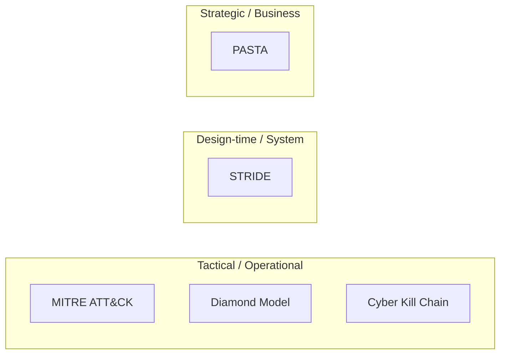
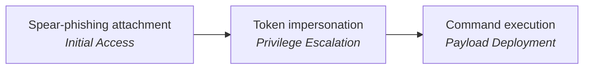
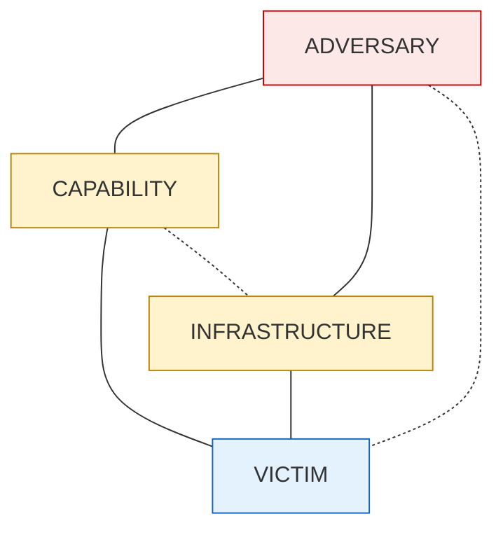
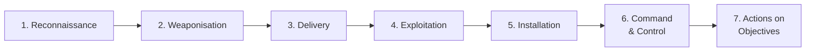
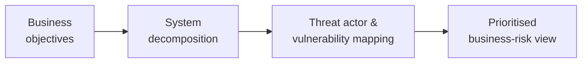

# Threat Modelling Frameworks

Reference for the major frameworks used to analyse adversary behaviour and security risk. Each framework offers a different lens; selection depends on the analytical goal and audience.

For threat actor categorisation see [01_THREAT_ACTOR_LANDSCAPE.md](./01_THREAT_ACTOR_LANDSCAPE.md). For navigation see [00_INTRODUCTION.md](./00_INTRODUCTION.md).

## At a Glance

| Framework | Lens | Best For | Audience |
|-----------|------|----------|----------|
| [MITRE ATT&CK](#mitre-attck) | Real-world TTPs by platform | Mapping behaviour, designing detection | SOC, threat hunters |
| [Diamond Model](#diamond-model) | Relationships between adversary, infrastructure, victim, capability | Campaign tracking, actor profiling | CTI analysts |
| [Cyber Kill Chain](#cyber-kill-chain) | Linear 7-phase attacker lifecycle | Layered defence, detection coverage | Defenders, response teams |
| [STRIDE](#stride) | 6 categories of system-level threats | Application security, design-time analysis | Developers, architects, blue teams |
| [PASTA](#pasta) | 7-stage attack simulation aligned to business risk | Strategic planning, board communication | CISOs, security leadership |

## Tactical vs Strategic Positioning

Tactical frameworks describe **adversary behaviour**. Design-time frameworks describe **system weaknesses**. Strategic frameworks tie threats to **business risk**. They are complementary, not exclusive — a single investigation may combine several.

---

## MITRE ATT&CK

The "Rosetta Stone" of adversary behaviour: a living knowledge base of real-world tactics, techniques, and procedures (TTPs), organised into matrices by platform — Windows, Linux, cloud, mobile.

It catalogues what attackers do and how, step by step. Example chain:

Aligns defence with **real adversary actions** rather than theoretical threats. Used to:

- Map incidents to known adversary behaviour
- Track threat actors across campaigns
- Design detection logic for SIEM rules
- Prioritise remediation based on actual risk

---

## Diamond Model

Multidimensional analysis built on relationships between four elements:

When a malicious indicator surfaces, the model prompts:

- Who operates this infrastructure?
- What malware is it tied to?
- Who are the targets?
- What other infrastructure connects to this?

Best for: campaign tracking, actor profiling, infrastructure clustering. Builds intelligence by drawing connections between otherwise isolated artefacts.

---

## Cyber Kill Chain

Developed by Lockheed Martin. Provides a linear view of the attacker's journey across seven phases. Defenders use it to design layered controls that detect and stop attacks before they cause damage — catching an attacker at the **delivery** phase neutralises the threat before execution.

Used for:

- Evaluating security posture across attack phases
- Designing proactive controls
- Training response teams on attacker progression

---

## STRIDE

Microsoft-developed model for application security and risk analysis. Asks **what could go wrong in a system** rather than what an attacker would do. Six threat categories:

| Letter | Threat | Asks |
|--------|--------|------|
| **S** | Spoofing | Can identity be impersonated? |
| **T** | Tampering | Can data be modified in transit or at rest? |
| **R** | Repudiation | Can a user deny their actions, or logs be erased? |
| **I** | Information disclosure | Can sensitive data leak? |
| **D** | Denial of service | Can the system be made unavailable? |
| **E** | Elevation of privilege | Can a user gain higher rights than intended? |

Example questions when modelling a login system: *can credentials be spoofed? can stored data be tampered with? can logs be erased?*

Best for: design-time risk analysis, anticipating vulnerabilities before they become exploitable. Audience: developers, architects, blue teams.

---

## PASTA

**Process for Attack Simulation and Threat Analysis** — the most comprehensive and business-aligned of the five. A seven-stage process designed to simulate attacks and quantify business impact, beginning with business objectives and culminating in a prioritised view of business-relevant risks.

Aligns threat modelling with **business risk** rather than purely technical exposure. Best for:

- Strategic security planning
- Board-level risk communication
- Business continuity integration

---

## Choosing a Framework

| Goal | Use |
|------|-----|
| Detect known adversary behaviour in logs | MITRE ATT&CK |
| Connect indicators across a campaign | Diamond Model |
| Identify gaps across attack phases | Cyber Kill Chain |
| Anticipate weaknesses in a new system design | STRIDE |
| Quantify and communicate business risk | PASTA |

Frameworks are complementary. A CTI team may use ATT&CK and the Diamond Model in the same investigation; a security architect uses STRIDE during design and PASTA at the programme level.

## See Also

- [01_THREAT_ACTOR_LANDSCAPE.md](./01_THREAT_ACTOR_LANDSCAPE.md) — actor categories, motivations, and attribution.
- [00_INTRODUCTION.md](./00_INTRODUCTION.md) — top-level reference index.
