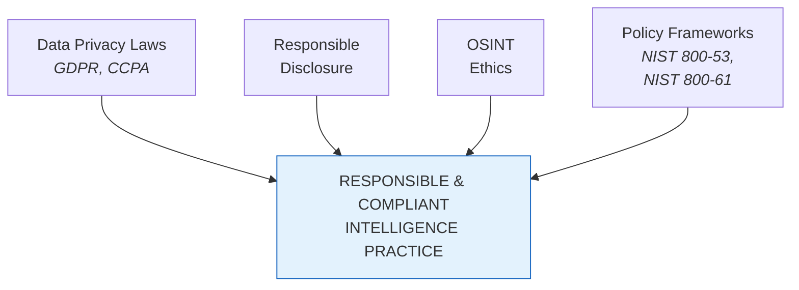
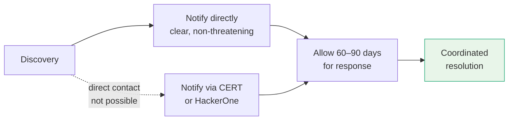
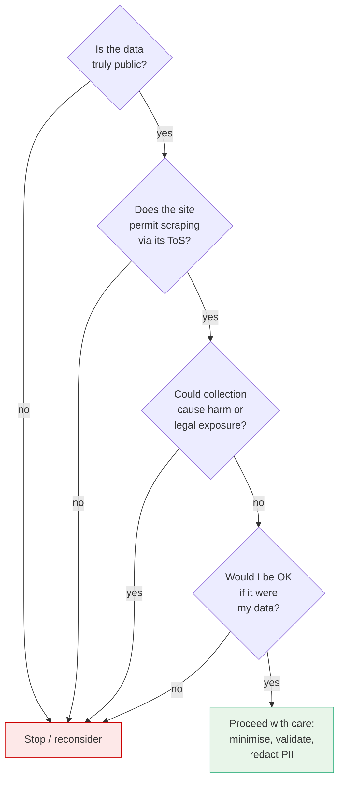
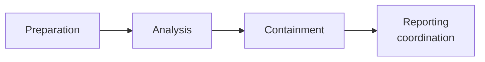

# Legal, Ethical, and Policy Considerations

Reference for the legal frameworks, ethical boundaries, and policy controls that govern threat intelligence collection and sharing.

> Just because you *can* collect data doesn't mean you *should*. Crossing legal or ethical lines isn't a professional misstep — it can lead to lawsuits, reputational damage, or worse.

For navigation see [00_INTRODUCTION.md](./00_INTRODUCTION.md).

## At a Glance

Four complementary areas: privacy law sets hard legal boundaries, responsible disclosure governs how findings are shared, OSINT ethics governs how data is collected, and policy frameworks formalise both into auditable controls.

---

## Data Privacy Laws — GDPR & CCPA

The two most influential privacy regulations both empower individuals over their personal data and restrict how organisations collect, process, and store it.

| | GDPR (EU) | CCPA (California, US) |
|--|-----------|------------------------|
| **Full name** | General Data Protection Regulation | California Consumer Privacy Act |
| **PII collection requirements** | Must be **lawful**, **transparent**, **necessary**, **secure**, and **removable upon request** | — |
| **Individual rights** | Access, rectification, erasure, portability | Know what is collected, opt out of sales, request deletion |

**Implication for threat intelligence:** harvesting data from open forums or breach dumps that contains PII — names, emails, phone numbers, IP addresses — carries accountability even when the data is publicly accessible, if it originated in a covered jurisdiction.

**Operating principles:**

- **Data minimisation** — collect only what is necessary for the investigation.
- **Purpose limitation** — use only within a clearly defined legal scope.

---

## Responsible Disclosure

Knowing when, how, and to whom to report vulnerabilities or indicators uncovered during research.

> If an exposed admin panel or unpatched CVE is discovered in someone else's infrastructure: **do not exploit it, do not access it** — report it.

**Principles:**

- Notify through clear, non-threatening messages.
- Avoid any coercion.
- Allow **60–90 days** for response.
- Use intermediaries like **CERT** or **HackerOne** when direct contact isn't possible.

The goal is collaboration, not exploitation — help, not harm, even unintentionally.

---

## OSINT Ethics

Open Source Intelligence being open does not make it a free-for-all. Source, context, and legality must each be assessed.

**Questions to ask before collecting:**

- Does it violate the site's terms of service?
- Is the content behind a login wall or intended for members only?
- Does the site prohibit scraping?
- Is the data **truly** public?
- Could collection create harm or legal exposure?

**Practices to avoid:**

- Mass-scraping LinkedIn profiles.
- Publishing threat actor PII without redaction.
- Using breached data without validation.

> **The ethical test:** *if it were your data, would you be okay with how it is being collected and used?*

---

## Policy Frameworks — NIST 800-53 & NIST 800-61

Formal policy frameworks turn ethical principles into auditable controls and defensible workflows.

### NIST 800-53

Catalogue of security and privacy controls for federal systems and organisations. Used to design compliant collection, storage, and sharing practices, especially around sensitive data.

Key controls relevant to intelligence work:

| Control | Name | Relevance |
|---------|------|-----------|
| **AC-6** | Least Privilege | Restrict access to the minimum necessary for the task |
| **IR-6** | Incident Reporting | Define how and to whom incidents are escalated |
| **PL-2** | System Security Plan | Document the security posture and applicable controls |

### NIST 800-61

Covers the incident-handling lifecycle.

These frameworks establish boundaries, build defensible workflows, and protect stakeholder trust.

---

## Key Points

- Intelligence professionals operate in grey areas — but that doesn't mean acting in the dark.
- **GDPR** and **CCPA** apply to publicly accessible data when PII is involved; the operating principles are **data minimisation** and **purpose limitation**.
- **Responsible disclosure** is collaborative — clear notification, 60–90 day response window, escalation via CERT or HackerOne when direct contact isn't possible.
- **OSINT ethics**: open ≠ unrestricted. Apply the *"would I be okay if it were my data?"* test.
- **NIST 800-53** provides the control catalogue (AC-6, IR-6, PL-2 are immediately relevant); **NIST 800-61** governs incident handling.

## See Also

- [00_INTRODUCTION.md](./00_INTRODUCTION.md) — top-level reference index.
- [01_THREAT_ACTOR_LANDSCAPE.md](./01_THREAT_ACTOR_LANDSCAPE.md) — actor categories and attribution.
- [02_THREAT_MODELLING_FRAMEWORKS.md](./02_THREAT_MODELLING_FRAMEWORKS.md) — analytical frameworks.
