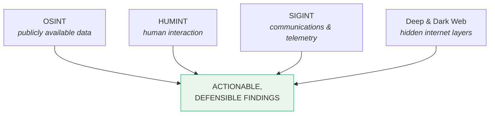
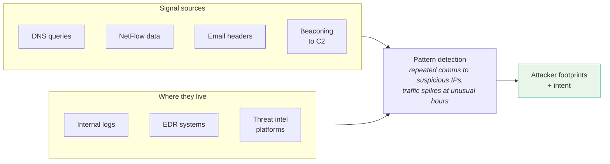

# Intelligence Collection Methodologies

Reference for the four primary intelligence collection disciplines used in threat intelligence work, the OSINT toolset, and the operational and ethical guardrails that apply across all of them.

For navigation see [00_INTRODUCTION.md](../01_Introduction_to_Threat_Intelligence/00_INTRODUCTION.md). For legal context see [03_LEGAL_ETHICAL_AND_POLICY.md](../01_Introduction_to_Threat_Intelligence/03_LEGAL_ETHICAL_AND_POLICY.md).

## At a Glance



| Discipline | What it is | Where it lives |
|------------|------------|----------------|
| **OSINT** — Open Source Intelligence | Publicly available data | Blogs, social media, GitHub, domain records, news |
| **HUMINT** — Human Intelligence | Information via human interaction | Forums, Telegram, private CTI groups, closed Slack/Discord |
| **SIGINT** — Signals Intelligence | Communications and telemetry | DNS, NetFlow, email headers, EDR, threat intel platforms |
| **Deep & Dark Web** | Hidden internet layers | Subscription portals (deep), Tor/I2P services (dark) |

---

## OSINT — Open Source Intelligence

The bread and butter of CTI operations. Public ≠ trivial: success isn't about volume, it's about value — analysing and enriching data with context, synthesising narratives rather than pulling indicators in isolation.

### Core Tools

| Tool | Purpose | Example |
|------|---------|---------|
| **Shodan.io** | "Google for exposed devices" — open ports, misconfigured servers, webcams, industrial control systems | `port:445 country:RU` → open SMB ports in Russia |
| **VirusTotal** | File / URL / domain analysis — antivirus aggregation, behaviour analytics, file relationships | Pivot: malware hash → related files → C2 domains → threat picture |
| **Maltego CE** | Link analysis across domains, IPs, hashes, identities, social networks | Phishing domain links to 10 others sharing the same registrant → threat cluster identified |

### Source Evaluation

For each data point, ask:

- **Timely** — is it current?
- **Relevant** — does it relate to the investigation?
- **Corroborated** — is it confirmed by independent sources?

---

## HUMINT — Human Intelligence

Information collected through human interaction. In cybersecurity that means:

- Monitoring threat actor chatter in forums and Telegram channels.
- Engaging with private info-sharing communities.
- Participating in closed Slack and Discord groups for CTI professionals.

**Trade-off:** early access to indicators can come with legal and ethical exposure. Vet sources carefully, assess credibility, and consider the legal implications of any engagement with threat actors.

---

## SIGINT — Signals Intelligence

Captures and analyses communications and telemetry to detect attacker patterns and triangulate intent.



---

## Deep & Dark Web Monitoring

```
   LAYER          ACCESS                                EXAMPLES
   ─────          ──────                                ────────
   Surface web    Indexed by search engines             Public blogs, news
   Deep web       Not indexed; gated / internal         Subscription platforms,
                                                        internal sites,
                                                        private portals
   Dark web       Intentionally hidden via Tor / I2P    Criminal marketplaces,
                                                        doxing sites,
                                                        malware forums
```

**Monitoring goals:**

- Track stolen credentials.
- Watch for brand and employee mentions.
- Identify zero-day exploits in circulation.

**Caution:** interacting with these platforms without legal guidance risks criminal liability. Use anonymisation tools and document collection methods to maintain a defensible chain of custody. See [03_LEGAL_ETHICAL_AND_POLICY.md](../01_Introduction_to_Threat_Intelligence/03_LEGAL_ETHICAL_AND_POLICY.md) for the legal context.

---

## Ethical & Operational Considerations

Across every method, three constants:

1. **Justify purpose** — collection serves a specific, defensible question.
2. **Validate sources** — trustworthy, recent, corroborated.
3. **Document chain of custody** — what was collected, when, how, by whom.

The goal of collection is **actionable, defensible findings** — the kind that can be reported with confidence.

---

## Key Points

- Four disciplines: **OSINT**, **HUMINT**, **SIGINT**, **Deep & Dark Web** — each with distinct sources and trade-offs.
- OSINT toolkit anchors on **Shodan**, **VirusTotal**, and **Maltego CE**; evaluate every data point for timeliness, relevance, and corroboration.
- HUMINT trades early access for ethical and legal risk — vet sources carefully.
- SIGINT detects patterns from technical telemetry (DNS, NetFlow, beaconing, email headers) across internal logs, EDR, and threat intel platforms.
- Deep web is gated; dark web is hidden. Both require legal guidance and anonymisation.
- Collection produces actionable, defensible findings: justified, validated, documented.

## See Also

- [00_INTRODUCTION.md](../01_Introduction_to_Threat_Intelligence/00_INTRODUCTION.md) — top-level reference index.
- [03_LEGAL_ETHICAL_AND_POLICY.md](../01_Introduction_to_Threat_Intelligence/03_LEGAL_ETHICAL_AND_POLICY.md) — legal frameworks (GDPR, CCPA), OSINT ethics, NIST controls.
