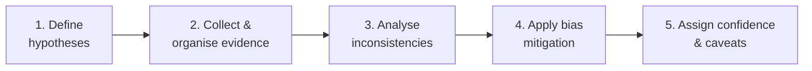

# Analysis of Competing Hypotheses (ACH)

Reference for ACH — a structured analytic technique developed by the **CIA** to help analysts make sound decisions under uncertainty by stress-testing competing explanations against the evidence.

For the broader analytic context see [section overview](./05_OVERVIEW.md). For confidence levels see [confidence levels in attribution](../01_Introduction_to_Threat_Intelligence/01_THREAT_ACTOR_LANDSCAPE.md#confidence-levels).

## Core Idea

ACH inverts the natural analytic instinct:

- **Don't** look for the hypothesis with the **most supporting evidence**.
- **Do** find the hypothesis with the **fewest critical contradictions**.

You're not picking your favourite — you're stress-testing each one. The best hypothesis is the one that **survives scrutiny**, not the one that fits most cleanly.

## The Five-Step Process

### 1. Define the Hypotheses

List **all plausible explanations**, not just the obvious ones.

**Example** — investigating a targeted phishing attack against a financial institution:

| ID | Hypothesis |
|----|------------|
| H1 | Financially motivated ransomware group |
| H2 | APT actor conducting espionage |
| H3 | Red team simulation mistakenly identified as malicious |
| H4 | False flag meant to mimic APT behaviour |

### 2. Collect and Organise Evidence

Gather: IOCs, infrastructure details, malware behaviour, targeting information, timing.

Build a **hypothesis-evidence matrix**. For each cell, mark whether the evidence:

- ✓ **Supports** the hypothesis
- ✗ Is **inconsistent** with the hypothesis
- · Is **neutral**

Example shape:

| Evidence | H1 | H2 | H3 | H4 |
|----------|----|----|----|----|
| C2 infrastructure overlap | · | ✓ | · | ✗ |
| Targeting alignment | ✗ | ✓ | · | · |
| Malware sophistication | · | ✓ | · | ✓ |
| Decoy markers absent | · | · | · | ✗ |
| Coordination with internal teams | · | · | ✗ | · |

### 3. Analyse Inconsistencies

Pick the hypothesis with the **fewest critical contradictions** — not the most support.

Following the example:

- **H1** fits much of the evidence but **fails to explain targeting**.
- **H2** explains targeting and TTPs, but **infrastructure doesn't fully align**.
- **H3** is unlikely due to **lack of coordination with internal teams**.
- **H4** is weakened by **lack of convincing decoy markers**.

H2 emerges as **most likely**, even with less support overall, because it has the fewest critical contradictions.

### 4. Apply Bias Mitigation

ACH actively counters **confirmation bias** and **groupthink**:

- Force consideration of all plausible options.
- Test each one objectively against the evidence.
- Invite peers to review the matrix and challenge the reasoning.

### 5. Assign Confidence and Caveats

Phrase the conclusion in calibrated confidence language. Example:

> *We assess with **moderate confidence** that the campaign is associated with an APT actor based on targeting alignment and TTPs, despite incomplete infrastructure attribution.*

That's an honest, defensible, professional conclusion — usable even in grey areas where no single piece of evidence is decisive.

## Key Points

- ACH is a **CIA-developed** technique for analysis under uncertainty.
- Eliminate hypotheses by **inconsistency**, not by acclaim.
- The **matrix** is the centrepiece — every piece of evidence is tested against every hypothesis.
- ACH actively counters **confirmation bias** and **groupthink**.
- Conclusions are always qualified with **confidence levels** and caveats.

## See Also

- [Section overview](./05_OVERVIEW.md)
- [Red Teaming](./07_RED_TEAMING.md) — complementary technique for challenging assumptions from an adversarial perspective.
- [Scenario Modelling](./08_SCENARIO_MODELLING.md)
- [Confidence levels in attribution](../01_Introduction_to_Threat_Intelligence/01_THREAT_ACTOR_LANDSCAPE.md#confidence-levels)
