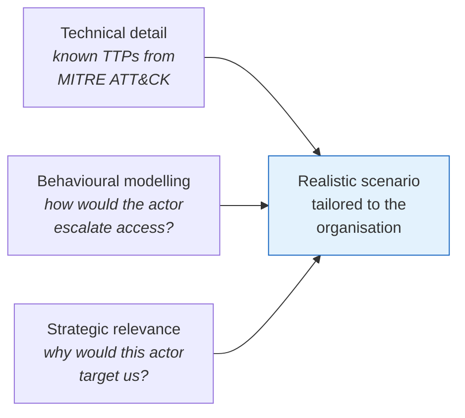

# Red Teaming

Reference for red teaming as a strategic analysis method — adversarial-perspective testing that challenges assumptions and uncovers blind spots beyond what technical assessments reveal.

For the broader analytic context see [section overview](./05_OVERVIEW.md).

## Core Idea

Red teaming is a **mindset shift**, not a more aggressive penetration test. The goal is to step into the adversary's shoes and challenge **everything** assumed to be secure — including people, processes, and perception, not just code and configurations.

## Red Teaming vs Other Simulation Methods

| Method | Goal | Perspective |
|--------|------|-------------|
| **Red teaming** | Challenge assumptions, uncover unknown weaknesses | Adversarial |
| **Wargaming** | Test decision-making across teams | Often neutral |
| **Tabletop exercise** | Walk through planned scenarios | Internal coordination |
| **Penetration testing** | Test technical controls | Technical attacker |

Red teaming targets **people, processes, and perception**. It is as much social engineering and organisational psychology as it is exploits.

## Strategic Use Cases

In threat intelligence, red teaming is used to:

- Simulate realistic threat campaigns (e.g., a ransomware affiliate targeting HR).
- **Challenge attribution assumptions** — *could this be a false flag?*
- Evaluate resilience to multi-stage threats.
- Stress-test detection and response across SOC, legal, PR, and executive layers.

The test isn't of controls alone — it's of how well the **entire organisation handles uncertainty and pressure**.

## Designing Realistic Scenarios

Effective scenarios blend three dimensions:

**Example campaign:**

> A fake job applicant emails a weaponised resume. The payload exploits a vulnerable macro plugin, installs a reverse shell, and begins lateral movement by abusing PowerShell remoting. The goal: access the CFO's email and exfiltrate sensitive merger discussions.

Rooted in reality, but tailored to the organisation's environment and threats.

## Blind Spots Red Teaming Reveals

Red teaming exposes more than technical gaps. Common findings:

| Type | Example |
|------|---------|
| Unchallenged assumptions | *"We don't need MFA internally"* |
| Processes that fail under pressure | Legal doesn't know who approves disclosure |
| Communication breakdowns | SOC never informed PR of a breach simulation |

## Deliverables

The deliverable is **insight**, not just findings. Use results to:

- Recommend **control improvements**.
- Guide **tabletop and incident response exercises**.
- Inform **executive-level risk decisions**.

## Key Points

- Red teaming is adversarial, mindset-driven testing — distinct from wargaming, tabletop exercises, and pentesting.
- Targets **people, processes, and perception**, not just technology.
- Scenarios blend TTPs (MITRE ATT&CK), behavioural modelling, and strategic relevance.
- Reveals blind spots: unchallenged assumptions, failing processes, communication breakdowns.
- Outputs feed control improvements, exercises, and executive decisions.

## See Also

- [Section overview](./05_OVERVIEW.md)
- [Analysis of Competing Hypotheses (ACH)](./06_ANALYSIS_OF_COMPETING_HYPOTHESES.md) — complementary technique for challenging assumptions analytically.
- [Scenario Modelling](./08_SCENARIO_MODELLING.md) — defender-perspective what-if analysis.
- [Threat modelling frameworks](../01_Introduction_to_Threat_Intelligence/02_THREAT_MODELLING_FRAMEWORKS.md) — frameworks used in scenario design.
