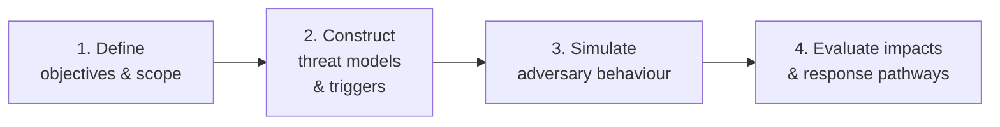
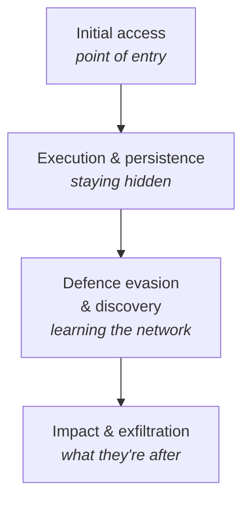

# Scenario Modelling

Reference for scenario modelling — a structured what-if technique that simulates threats before they happen, so the organisation can plan response rather than react under pressure.

For the broader analytic context see [section overview](./05_OVERVIEW.md).

## Core Idea

Scenario modelling lets you ask **what if** in a structured, strategic way. Unlike [red teaming](./07_RED_TEAMING.md), which tests the organisation from an external attacker's perspective, scenario modelling builds **simulated environments** to explore internal response, risk impacts, and potential futures.

> Scenario modelling isn't about prediction — it's about preparedness.

## The Four-Part Process

### 1. Define Objectives and Scope

Identify:

- **What system or asset** are we protecting?
- **What threat actor profile** are we simulating?
- **What risk or decision** are we trying to explore?

**Example:** assess how a cloud-based HR platform would hold up under attack by an APT group targeting PII. This defines the *crown jewels*, the *threat lens*, and the *strategic concern*.

### 2. Construct Threat Models and Triggers

Use established frameworks:

| Framework | Use |
|-----------|-----|
| [MITRE ATT&CK](../01_Introduction_to_Threat_Intelligence/02_THREAT_MODELLING_FRAMEWORKS.md#mitre-attck) | Select realistic adversary TTPs |
| **NIST 800-30** / [STRIDE](../01_Introduction_to_Threat_Intelligence/02_THREAT_MODELLING_FRAMEWORKS.md#stride) | Map threats to enterprise risk |
| [PASTA](../01_Introduction_to_Threat_Intelligence/02_THREAT_MODELLING_FRAMEWORKS.md#pasta) | Define attacker motivation and likely attack stages |

Then build the timeline:

- What event **triggers** the scenario?
- How does the attacker **progress**?
- What does **success look like** from their perspective?

**Example:** a malicious contractor gains initial access through VPN, escalates privileges via token impersonation, and exfiltrates payroll data via cloud storage sync. Credible, sequenced events — not invented chaos.

### 3. Simulate Adversary Behaviour

Map the scenario across attack layers:

Calibrate against:

- **Attacker skill level** — sophisticated APT or commodity criminal?
- **Available tools and access** — what would they realistically have?
- **Realistic timelines and dwell time** — days, weeks, or months?

The model should reflect not only how the attack happens, but also how defenders might detect, escalate, or contain it.

### 4. Evaluate Impacts and Response Pathways

Assess across three axes:

| Axis | Questions |
|------|-----------|
| **Detection coverage** | Do we have the right logs, alerts, controls in place? |
| **Response capabilities** | Can the team contain, communicate, and recover? |
| **Business impact** | What's the potential reputational, legal, or operational damage? |

Useful visuals: **attack timelines**, **decision trees**, **MITRE ATT&CK heat maps**.

Don't stop at *what went wrong*. Ask the strategic question:

> What could we have done differently to reduce the impact or likelihood?

## Key Points

- Structured what-if technique — explores **internal response**, not just adversary actions.
- Four-part process: scope → models & triggers → behaviour simulation → impact & response.
- Anchors on established frameworks: MITRE ATT&CK, NIST 800-30, STRIDE, PASTA.
- Output is a **preparedness picture** across detection, response, and business impact.
- Goal: **preparedness, not prediction**.

## See Also

- [Section overview](./05_OVERVIEW.md)
- [Red Teaming](./07_RED_TEAMING.md) — adversarial-perspective testing.
- [Analysis of Competing Hypotheses (ACH)](./06_ANALYSIS_OF_COMPETING_HYPOTHESES.md)
- [Threat modelling frameworks](../01_Introduction_to_Threat_Intelligence/02_THREAT_MODELLING_FRAMEWORKS.md) — STRIDE, PASTA, ATT&CK, etc.
