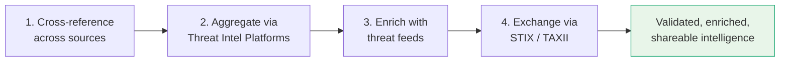
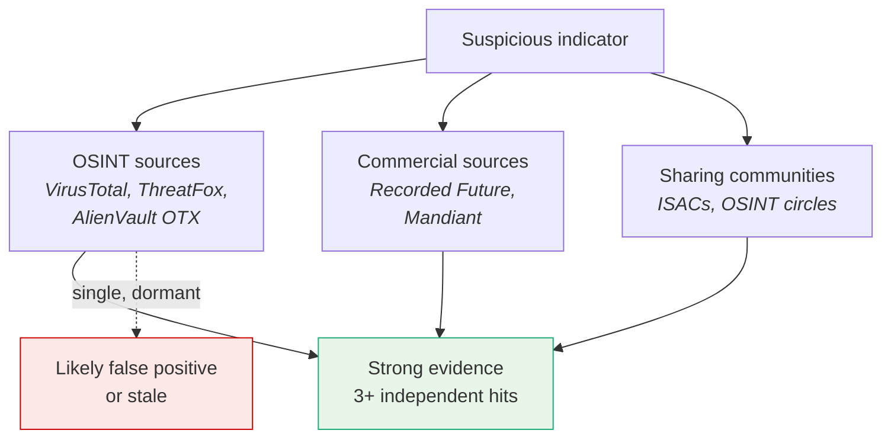
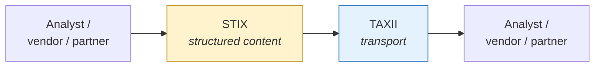

# Data Enrichment and Validation

Reference for transforming raw threat data into validated, enriched, and shareable intelligence — the practices, platforms, feeds, and exchange standards that make CTI conclusions defensible.

For navigation see [top-level index](../01_Introduction_to_Threat_Intelligence/00_INTRODUCTION.md).

## Core Idea

Raw data is **noise until validated**. A report built on fake IOCs or outdated hashes can mislead a CISO or waste incident-response time. Enrichment and validation are not nice-to-haves — they're what makes intelligence defensible.

## At a Glance

---

## 1. Cross-Referencing Across Sources

The starting principle: **don't trust any single source**. Triangulate credibility by looking for overlap across providers.

When a suspicious domain surfaces in a phishing email, check:

- **OSINT feeds** — VirusTotal, ThreatFox, AlienVault OTX
- **Commercial feeds** — Recorded Future, Mandiant
- **Sharing communities** — ISACs, OSINT circles

If the indicator appears in three independent sources (one OSINT, one commercial, one sandbox), there is **strong evidence for maliciousness**. If it appears in only one and hasn't been active in six months, it's probably **noise**.

---

## 2. Threat Intelligence Platforms (TIPs)

TIPs **aggregate, normalise, and correlate** intelligence from multiple sources.

| Platform |
|----------|
| **ThreatConnect** |
| **Anomali ThreatStream** |
| **MISP** — Malware Information Sharing Platform |
| **Recorded Future** |

With a TIP you can:

- **Enrich IOCs** by discovering associated malware and campaigns.
- **Assess risk scores** based on frequency and severity.
- **Automate lookups and alerting** via SIEM integrations.

TIPs transform raw data into actionable intelligence at scale.

---

## 3. Enriching with Threat Feeds

A file hash alone has limited value. Enrichment answers:

- What **malware family** does it belong to?
- Has it been **seen recently**?
- What's its **behaviour and detection rate**?
- Are there **related hashes** with similar behaviour?

| Source | Type |
|--------|------|
| **CISA Known Exploited Vulnerabilities Catalog** | Public, authoritative vulnerability list |
| **Abuse.ch** (ThreatFox, URLhaus) | Open feeds for malware and URLs |
| **CrowdStrike** | Commercial threat intelligence |
| **Cisco Talos** | Commercial threat intelligence |

Each enrichment layer helps you **understand the threat landscape**, not just react to it.

---

## 4. STIX and TAXII Standards

Raw threat intel is messy. Standardised formats are needed to share, query, and integrate it across tools and teams.

| Standard | Role |
|----------|------|
| **STIX** — Structured Threat Information Expression | Format for describing indicators, behaviours, TTPs, and relationships |
| **TAXII** — Trusted Automated Exchange of Indicator Information | Transport protocol for querying and sharing STIX data |

**STIX fields include:**

- **Indicator types** — domains, hashes, IPs.
- **Observed data** — timestamps, artefacts.
- **Threat actors** — names, motivations.
- **Attack patterns** — mapped to MITRE TTPs.

**Benefits:**

- Better collaboration between analysts, vendors, and partners.
- Faster SOC detection through automated ingestion.
- Clear audit trails for shared intelligence.

---

## Quality Dimensions

Every threat data point should be evaluated on three axes:

| Dimension | Question |
|-----------|----------|
| **Timeliness** | Is it fresh, or outdated? |
| **Relevance** | Does it apply to this organisation or industry? |
| **Confidence** | Is the source reliable and the data corroborated? |

**Example confidence assessment:**

> *We assess with **high confidence** that this hash links to the ongoing Emotet campaign, based on enrichment from three independent feeds.*

## Key Points

- Validation starts with **cross-referencing** — never trust a single source.
- **TIPs** (ThreatConnect, Anomali, MISP, Recorded Future) aggregate, normalise, and correlate intelligence at scale.
- **Threat feeds** (CISA KEV, Abuse.ch, CrowdStrike, Cisco Talos) provide the raw enrichment material.
- **STIX/TAXII** standardise the content (STIX) and transport (TAXII) of shared intel.
- Every data point earns its place by **timeliness**, **relevance**, and **confidence**.

## See Also

- [Intelligence collection methodologies](../02_Intelligence_Collection_and_Infrastructure/04_INTELLIGENCE_COLLECTION_METHODOLOGIES.md) — where the raw data comes from.
- [Threat modelling frameworks](../01_Introduction_to_Threat_Intelligence/02_THREAT_MODELLING_FRAMEWORKS.md) — for mapping enriched intel onto adversary TTPs.
- [Confidence levels in attribution](../01_Introduction_to_Threat_Intelligence/01_THREAT_ACTOR_LANDSCAPE.md#confidence-levels)
- [Top-level index](../01_Introduction_to_Threat_Intelligence/00_INTRODUCTION.md).
