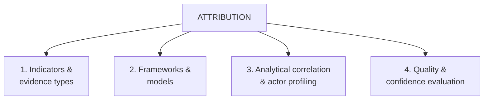
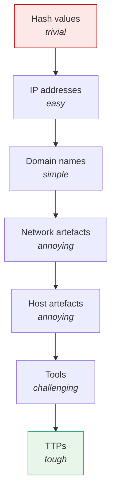

# Attribution Frameworks

Reference for the structured frameworks that bring clarity to threat-actor attribution. Attribution is the process of answering *"who is behind this?"* — but it's also about understanding *why*, *how*, and *what else they might target*.

For broader analytic context see [Structured Analytical Techniques overview](../03_Structured_Analytical_Techniques/05_OVERVIEW.md). For pitfalls see [Attribution Challenges](./11_ATTRIBUTION_CHALLENGES.md). For real-world cases see [Attribution Case Studies](./12_ATTRIBUTION_CASE_STUDIES.md).

## Four Core Elements

## 1. Attribution Indicators and Evidence Types

Attribution relies on multiple layers of evidence. Each layer adds a piece; only when correlated and contextualised do they tell a coherent story.

| Layer | Examples |
|-------|----------|
| **Technical artefacts** | Hashes, IP addresses, domains, TLS certificates |
| **Behavioural patterns** | TTPs, campaign timelines, persistence strategies |
| **Infrastructure** | Hosting providers, dynamic DNS, server fingerprints |
| **Language and time metadata** | File compile timestamps, language packs, working hours |
| **Strategic context** | Geopolitical targets, economic timing, ideological alignment |

## 2. Attribution Frameworks and Models

Three structured frameworks help analysts assign responsibility while reducing cognitive bias.

### Diamond Model

Maps adversary, infrastructure, victim, and capability in a four-point relational model. Trace connections across campaigns, understand infrastructure shifts, visualise attacker–victim relationships.

Full reference: [Diamond Model](../01_Introduction_to_Threat_Intelligence/02_THREAT_MODELLING_FRAMEWORKS.md#diamond-model).

### Pyramid of Pain

Ranks IOCs by how disruptive they are for the adversary to change. Detection and attribution effort focused at the top of the pyramid yields the most durable results.

The higher the rung, the harder it is for the adversary to change without significant effort.

### Kill Chain + MITRE ATT&CK Integration

Use the [Cyber Kill Chain](../01_Introduction_to_Threat_Intelligence/02_THREAT_MODELLING_FRAMEWORKS.md#cyber-kill-chain) for stage-based tracking and [MITRE ATT&CK](../01_Introduction_to_Threat_Intelligence/02_THREAT_MODELLING_FRAMEWORKS.md#mitre-attck) to map specific behaviours. Combined, they correlate campaign phases with known actor playbooks.

## 3. Analytical Correlation and Actor Profiling

Once evidence and tactics are mapped, profile the actor. Triangulate from multiple angles:

- Is this actor known for this malware or targeting pattern?
- Do behaviours match historic campaigns?
- Is there infrastructure or tooling reuse connecting the dots?

| Tool | Use |
|------|-----|
| **ThreatConnect** | Correlate across data sources |
| **MISP** | Share structured intelligence |
| **Malpedia** | Malware family and TTP mapping |
| **ATT&CK Navigator** | Visualise TTP coverage and overlap |

The aim is **triangulation** — supporting a hypothesis with multiple angles of analysis, not just finding a single match.

## 4. Evaluating Attribution Quality and Confidence

Attribution is rarely absolute. Grade it by confidence based on:

- **Source reliability**
- **Evidence credibility**
- **Volume and variety** of indicators
- **Consistency with past activity**
- **Bias awareness and documentation**

**Example confidence statement:**

> *With **moderate confidence**, we assess this activity to be aligned with APT41 based on tool reuse, timing, and infrastructure overlap.*

Frameworks provide the structured vocabulary and methodology that make these judgements credible, transparent, and repeatable.

## Key Points

- Five evidence layers: technical artefacts, behaviours, infrastructure, language/time metadata, strategic context.
- Three structured frameworks: **Diamond Model**, **Pyramid of Pain**, **Kill Chain + ATT&CK**.
- Profile actors by triangulating multiple angles, not single-source matches.
- Confidence assessment is the output that makes attribution defensible.

## See Also

- [Attribution Challenges](./11_ATTRIBUTION_CHALLENGES.md) — false flags, biases, geopolitics.
- [Attribution Case Studies](./12_ATTRIBUTION_CASE_STUDIES.md) — APT28, NotPetya, Sony/Lazarus.
- [Threat actor landscape](../01_Introduction_to_Threat_Intelligence/01_THREAT_ACTOR_LANDSCAPE.md) — actor categories and basic attribution.
- [Threat modelling frameworks](../01_Introduction_to_Threat_Intelligence/02_THREAT_MODELLING_FRAMEWORKS.md) — Diamond Model, Kill Chain, ATT&CK detail.
- [Confidence levels](../01_Introduction_to_Threat_Intelligence/01_THREAT_ACTOR_LANDSCAPE.md#confidence-levels)
- [Intelligence confidence language](../06_Intelligence_Confidence_and_Enterprise_Risk_Modelling/13_INTELLIGENCE_CONFIDENCE_LANGUAGE.md) — Sherman–Kent scale.
