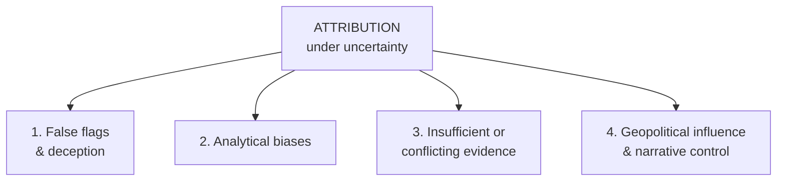

# Attribution Challenges

Reference for the pitfalls that make attribution the most sought-after — and most misunderstood — outcome in cyber intelligence. Behind every attribution claim lies a minefield of deception, bias, and geopolitical complexity.

For methodology see [Attribution Frameworks](./10_ATTRIBUTION_FRAMEWORKS.md). For real-world examples see [Attribution Case Studies](./12_ATTRIBUTION_CASE_STUDIES.md).

## Four Major Challenges

## 1. False Flags and Deception Operations

Some actors don't just try to avoid detection — they try to **mislead** attribution.

Common deception techniques:

- Reuse tools from other threat actors.
- Mimic TTPs of well-known groups.
- Use languages or compile times to suggest a different region.
- Drop breadcrumbs pointing to a fabricated origin.

**Example:** a campaign deploys malware previously associated with **Lazarus Group**, but the infrastructure is rented from a region commonly used by **Russian** actors, and the payload includes broken Korean strings. Is it North Korea, Russia, or a third actor trying to frame them both?

Attribution must go beyond surface indicators and consider the **full context**.

## 2. Attribution Biases and Analytical Pitfalls

Human thinking introduces noise into analysis.

| Bias | Description |
|------|-------------|
| **Anchoring bias** | Fixating on the first hypothesis formed |
| **Confirmation bias** | Seeking evidence that supports an existing belief |
| **Attribution momentum** | Assuming new activity belongs to a known actor without re-evaluating |

**Mitigations:**

- Apply [ACH](../03_Structured_Analytical_Techniques/06_ANALYSIS_OF_COMPETING_HYPOTHESES.md) or other structured techniques.
- Invite peer review or [red teaming](../03_Structured_Analytical_Techniques/07_RED_TEAMING.md).
- Force generation and testing of alternative hypotheses.
- Document assumptions and caveats explicitly.

Structured thinking reduces emotional and organisational influence on conclusions.

## 3. Insufficient or Conflicting Evidence

Sometimes there isn't enough evidence — or worse, the evidence contradicts itself.

| Pattern | Implication |
|---------|-------------|
| TTPs align with APT29, but targeting is inconsistent | Partial match — need more data |
| Infrastructure is reused but previously attributed to multiple actors | Ambiguous — don't force a single actor |
| Tooling overlaps, but source code is publicly available | Tool ≠ actor |

**Don't force attribution.** Focus on **capability** and **intent**, not actor identity.

Use qualifiers like:

> *This campaign demonstrates TTPs commonly used by APT29, but attribution remains unclear due to infrastructure ambiguity.*

That's still a valuable, honest intelligence product.

## 4. Geopolitical Influence and Narrative Control

Attribution isn't just technical — it's political. Governments, media, and corporations all have stakes in:

- Framing attackers in certain regions.
- Timing attribution disclosures.
- Suppressing or amplifying intelligence for strategic reasons.

**Analyst's responsibility:** acknowledge external pressures while protecting analytical integrity.

- Document how conclusions were reached.
- Avoid assigning attribution based on political alignment or assumption.

**Example phrasing:**

> *While this activity has been publicly linked to Country X, our analysis remains focused on the TTPs, infrastructure, and targeting behaviours, not nationality.*

This preserves credibility and objectivity.

## Key Points

- **False flags** require context analysis beyond surface indicators.
- **Bias** types — anchoring, confirmation, momentum — countered with structured techniques.
- **Insufficient evidence** demands honest uncertainty acknowledgement, not forced attribution.
- **Geopolitical pressures** require analytical-integrity protection.
- A critical, methodical approach produces credible attribution assessments.

## See Also

- [Attribution Frameworks](./10_ATTRIBUTION_FRAMEWORKS.md)
- [Attribution Case Studies](./12_ATTRIBUTION_CASE_STUDIES.md)
- [Analysis of Competing Hypotheses (ACH)](../03_Structured_Analytical_Techniques/06_ANALYSIS_OF_COMPETING_HYPOTHESES.md) — primary bias-mitigation technique.
- [Intelligence confidence language](../06_Intelligence_Confidence_and_Enterprise_Risk_Modelling/13_INTELLIGENCE_CONFIDENCE_LANGUAGE.md)
