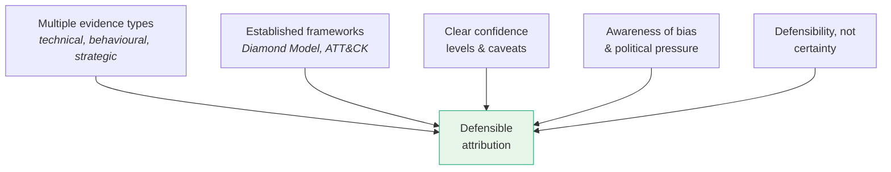

# Attribution Case Studies

Reference of three high-profile attribution cases, each illustrating different strengths and limitations of public attribution.

For methodology see [Attribution Frameworks](./10_ATTRIBUTION_FRAMEWORKS.md). For pitfalls see [Attribution Challenges](./11_ATTRIBUTION_CHALLENGES.md).

## At a Glance

| Case | Year | Attributed To | Type |
|------|------|---------------|------|
| [APT28 / DNC Hack](#apt28--dnc-hack-2016) | 2016 | Russian GRU (APT28 / Fancy Bear) | Influence operation |
| [NotPetya](#notpetya--wiper-disguised-as-ransomware-2017) | 2017 | Russian GRU | Destructive supply-chain attack |
| [Sony Pictures](#sony-pictures--lazarus-group-2014) | 2014 | DPRK (Lazarus Group) | Retaliatory destructive attack |

---

## APT28 / DNC Hack (2016)

The Democratic National Committee was breached and emails were leaked publicly, impacting the US election.

**Attribution evidence:**

- Malware used: **X-Agent**, **Sofacy**.
- Infrastructure overlap with prior military targeting.
- TTPs aligned with **GRU** (Russian military intelligence).
- Documented work hours and compile times aligned with Moscow business hours.
- Attributed by US intelligence and private firms (CrowdStrike, FireEye).

**Strengths:**

- Consistent TTPs and malware lineage.
- Multiple independent sources.
- Strong geopolitical motive alignment.

**Limitations:**

- Attribution politicised in media.
- High public confidence asserted without revealing full technical evidence.
- Did not fully account for potential false-flag operations.

**Lesson:** structured technical and behavioural evidence supported attribution, but **transparency and communication framing mattered just as much**.

---

## NotPetya — Wiper Disguised as Ransomware (2017)

Destructive malware spread through Ukrainian tax software, crippling global companies including Maersk and Merck.

**Attribution evidence:**

- Used a fake ransomware screen but offered no way to recover files.
- Targeted primarily Ukrainian infrastructure.
- Shared codebase and TTPs with **BlackEnergy** (used in Ukraine grid attacks).
- Infrastructure reuse tied to suspected Russian GRU activity.
- Attributed by NSA, UK NCSC, and private firms.

**Strengths:**

- Clear campaign-level overlap.
- Behaviour aligned with strategic disruption, not profit.
- Coordinated multi-source assessment.

**Limitations:**

- Attribution clarity emerged only **after widespread damage**.
- Ransomware disguise introduced initial confusion.
- Commercial actors hesitated to attribute without state-level backup.

**Lesson:** adversaries can **obscure intent**, making attribution dependent on behavioural inference and geopolitical context.

---

## Sony Pictures / Lazarus Group (2014)

Sony Pictures was hacked, files were destroyed, and sensitive emails leaked — reportedly in response to the film *The Interview*.

**Attribution evidence:**

- Malware matched earlier Lazarus samples.
- C2 infrastructure and hard-coded IPs overlapped with prior DPRK activity.
- Spear-phishing techniques consistent with the Lazarus playbook.
- Publicly attributed to North Korea by FBI/NSA.

**Strengths:**

- Strong technical correlation: code similarity, infrastructure reuse.
- Clear political context and stated threat motive.
- US government released detailed indicators.

**Limitations:**

- Attribution questioned due to limited publicly shared evidence.
- Some analysts argued for insider threat or false flag.
- Political motivation complicated reception of the attribution.

**Lesson:** even when attribution is technically solid, **confidence in the message can erode without transparency and broad stakeholder buy-in**.

---

## Best Practices Across Cases

| Principle | Why |
|-----------|-----|
| Use multiple evidence types (technical, behavioural, strategic) | Single-axis evidence is fragile |
| Leverage frameworks like Diamond Model or ATT&CK | Structure makes the analysis repeatable |
| Express confidence levels and caveats clearly | Honest uncertainty is more credible than false certainty |
| Be aware of public perception, bias, and political pressure | External pressures can distort otherwise sound analysis |
| Prioritise **defensibility, not certainty** | An assessment that holds up under scrutiny wins trust |

## Key Points

- Three case studies — DNC, NotPetya, Sony — show varied attribution approaches.
- Multiple evidence types strengthen attribution confidence.
- **Transparency and communication** affect attribution credibility as much as technical evidence does.
- Political context complicates attribution acceptance.
- Defensible methodology matters more than absolute certainty.

## See Also

- [Attribution Frameworks](./10_ATTRIBUTION_FRAMEWORKS.md)
- [Attribution Challenges](./11_ATTRIBUTION_CHALLENGES.md)
- [Threat actor landscape](../01_Introduction_to_Threat_Intelligence/01_THREAT_ACTOR_LANDSCAPE.md) — APT, criminal, and other actor categories.
