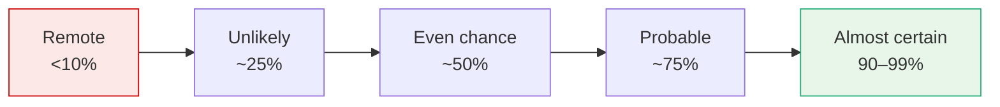
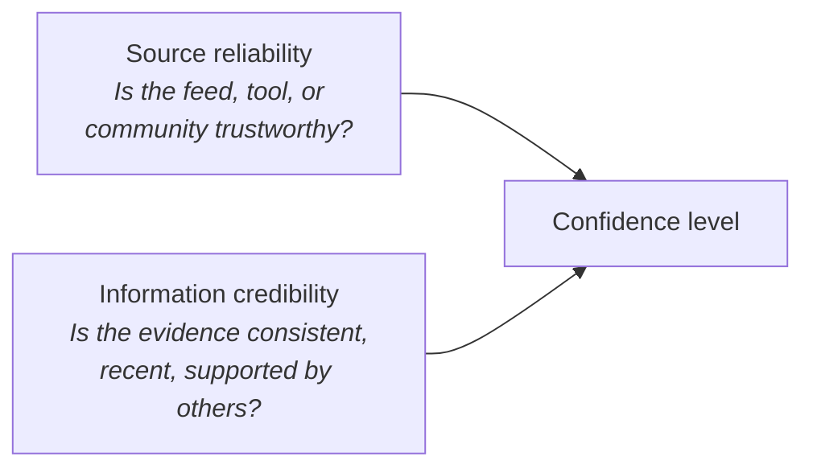

# Intelligence Confidence Language

Reference for communicating analytical certainty in intelligence assessments. **How** you communicate certainty is as important as what you're saying — confidence language is the bridge between technical findings and decision-making clarity.

For attribution context see [Attribution Challenges](../05_Attribution/11_ATTRIBUTION_CHALLENGES.md). For applying confidence in actor attribution see [confidence levels](../01_Introduction_to_Threat_Intelligence/01_THREAT_ACTOR_LANDSCAPE.md#confidence-levels).

## The Sherman–Kent Confidence Scale

Originally developed by the CIA. Assigns qualitative language to estimated probability ranges.

| Term | Estimated likelihood |
|------|----------------------|
| **Almost certain** | 90–99% |
| **Probable** | ~75% |
| **Even chance** | ~50% |
| **Unlikely** | ~25% |
| **Remote** | <10% |

In CTI work this is often simplified to three levels:

| Level | Evidence basis |
|-------|----------------|
| **High confidence** | Strong, corroborated evidence |
| **Moderate confidence** | Some reliable evidence, but gaps exist |
| **Low confidence** | Fragmented or uncorroborated evidence |

These terms set expectations for SOC, executives, and external consumers.

## Applying Likelihood Terminology

Confidence language transforms a flat assertion into an actionable intelligence product.

| Avoid | Prefer |
|-------|--------|
| *APT29 is responsible for this campaign.* | *We assess with **moderate confidence** that APT29 is responsible for this campaign, based on partial infrastructure overlap and recurring TTPs observed in past activity.* |

The improved version:

- Frames the level of certainty.
- Acknowledges limitations.
- Helps readers make informed decisions.

**Useful phrasings:** *it is likely that…*, *we assess with low confidence…*, *there is some indication that…*

**Avoid extremes** like *definitely* or *might be*, unless qualified with explicit context.

## Sourcing and Evidence Evaluation

Confidence is grounded in two dimensions:

| Example | Confidence |
|---------|------------|
| Phishing domain seen in a sandbox **and** listed in two commercial feeds | **High** |
| Single Reddit post with an unverified hash | **Low** (even if it feels relevant) |

For each piece of evidence ask:

- Is this corroborated?
- Does it align with historical behaviour?
- Are there any major gaps?

## Revising Analytic Judgements

Take a flat statement and elevate it through three additions:

| Layer | Result |
|-------|--------|
| **Original** | *It is highly likely that this malware belongs to APT33.* |
| **+ Source context** | *Based on telemetry from MISP and analyst reports…* |
| **+ Confidence qualifier** | *…with moderate confidence due to partial TTP overlap…* |
| **+ Caveat** | *…some artefacts suggest possible tooling reuse by other actors.* |

The result moves the assessment from **opinion** to **structured assessment**.

## Key Points

- **Sherman–Kent** provides standardised, calibrated confidence terminology.
- CTI work simplifies it to **high / moderate / low**.
- Confidence is grounded in **source reliability** and **information credibility**.
- Likelihood language frames certainty without false absolutes.
- Structured revision (source + qualifier + caveat) elevates assessments beyond opinion.

## See Also

- [Threat modelling for enterprise risk](./14_THREAT_MODELLING_FOR_ENTERPRISE_RISK.md)
- [Threat model design with NIST 800-30 / STRIDE](./15_THREAT_MODEL_DESIGN_NIST_AND_STRIDE.md)
- [Attribution challenges](../05_Attribution/11_ATTRIBUTION_CHALLENGES.md) — where confidence language matters most.
- [Confidence levels in attribution](../01_Introduction_to_Threat_Intelligence/01_THREAT_ACTOR_LANDSCAPE.md#confidence-levels)
- [Data enrichment and validation](../04_Data_Analysis_and_Validation/09_DATA_ENRICHMENT_AND_VALIDATION.md) — quality dimensions feeding confidence.
