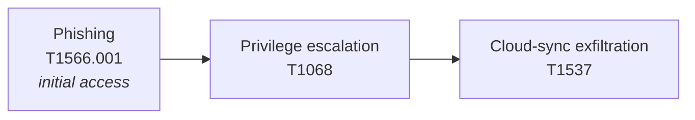

# Threat Modelling for Enterprise Risk

Reference for selecting and applying threat modelling frameworks within an enterprise context. Threats live in the organisation's environment — modelling connects them to the systems, processes, and people that keep the business running.

For framework definitions and comparison see [Threat modelling frameworks](../01_Introduction_to_Threat_Intelligence/02_THREAT_MODELLING_FRAMEWORKS.md). For practical model construction see [Threat Model Design — NIST 800-30 and STRIDE](./15_THREAT_MODEL_DESIGN_NIST_AND_STRIDE.md).

## Threat Modelling as Strategic Intelligence

Threat modelling is not just for application security. As a strategic intelligence tool it:

- Identifies where the organisation is **vulnerable**.
- Predicts which threats matter **most**.
- Recommends actions that reduce **real-world** risk.

## Three Approaches

| Framework | Lens | Best For |
|-----------|------|----------|
| **STRIDE** | Application-centric — what could go wrong in a system | App design reviews, IAM audits, internal system assessments |
| **MITRE ATT&CK** | Behaviour-based — adversary playbook | Detection coverage, control gap analysis, alignment with known actors |
| **PASTA** | Business-aligned — strategic risk evaluation | CISO/legal/board advisory, long-term security investment plans |

### STRIDE — Application-Centric

Categorises threats by impact type (Spoofing, Tampering, Repudiation, Information disclosure, Denial of service, Elevation of privilege). Ties directly to controls like authentication, auditing, and encryption.

**Example:** in a web app, STRIDE asks whether session tokens could be spoofed, whether input fields could lead to data tampering.

Detail: [STRIDE](../01_Introduction_to_Threat_Intelligence/02_THREAT_MODELLING_FRAMEWORKS.md#stride).

### MITRE ATT&CK — Behaviour-Based

Tactics → techniques → procedures. Models how attackers would move through the enterprise environment.

**Example attack chain:**

The shift in framing: from *"we have vulnerabilities"* to *"here's how an adversary would move through our network."*

Detail: [MITRE ATT&CK](../01_Introduction_to_Threat_Intelligence/02_THREAT_MODELLING_FRAMEWORKS.md#mitre-attck).

### PASTA — Business-Aligned Risk

Seven-stage process aligning attack simulation with business impact:

1. Define business objectives.
2. Identify technical scope.
3. Decompose the system.
4. Analyse threats.
5. Identify vulnerabilities.
6. Simulate attacks.
7. Evaluate business impact and risk.

**Example:** model an HR system data exfiltration scenario, then quantify potential **GDPR fines**, **reputational risk**, and **legal implications**. PASTA bridges the gap between technical indicators and **executive decisions**.

Detail: [PASTA](../01_Introduction_to_Threat_Intelligence/02_THREAT_MODELLING_FRAMEWORKS.md#pasta).

## Choosing the Right Model

| Use case | Best fit |
|----------|----------|
| Secure software design | **STRIDE** |
| Threat detection and response | **MITRE ATT&CK** |
| Business risk and strategy | **PASTA** |

The best analysts know when to **blend** them or **translate** between them for different audiences — STRIDE findings can be reframed for executives via PASTA, and ATT&CK behaviour maps can guide STRIDE component analysis.

## Key Points

- Threat modelling is a strategic intelligence tool, not just an AppSec exercise.
- **STRIDE** for application security, **ATT&CK** for adversary behaviour, **PASTA** for business risk.
- Selection depends on audience and use case.
- Blending and translating between frameworks delivers the most value.

## See Also

- [Threat modelling frameworks](../01_Introduction_to_Threat_Intelligence/02_THREAT_MODELLING_FRAMEWORKS.md) — full framework reference.
- [Threat model design with NIST 800-30 / STRIDE](./15_THREAT_MODEL_DESIGN_NIST_AND_STRIDE.md) — turning frameworks into deliverables.
- [Intelligence confidence language](./13_INTELLIGENCE_CONFIDENCE_LANGUAGE.md)
- [Scenario modelling](../03_Structured_Analytical_Techniques/08_SCENARIO_MODELLING.md) — uses these frameworks in simulated environments.
