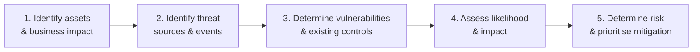
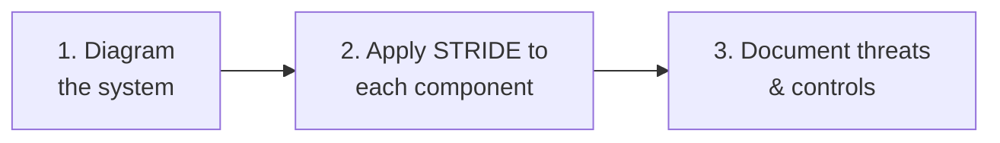

# Threat Model Design — NIST 800-30 and STRIDE

Reference for building actionable, business-aligned threat models using two proven approaches: **NIST SP 800-30** for risk assessment and control alignment, and **STRIDE** for system-level threat enumeration.

For framework selection see [Threat Modelling for Enterprise Risk](./14_THREAT_MODELLING_FOR_ENTERPRISE_RISK.md). For framework definitions see [Threat modelling frameworks](../01_Introduction_to_Threat_Intelligence/02_THREAT_MODELLING_FRAMEWORKS.md).

## NIST SP 800-30 — Risk-Centred Design

A structured methodology for risk assessment and mitigation, suited to risk owners, auditors, and leadership communication.

| Step | Activity |
|------|----------|
| **1** | Identify critical systems (databases, cloud, APIs); define what's at stake — **confidentiality, integrity, availability** (or all three); interview stakeholders for operational dependencies. |
| **2** | Use TTP libraries like [MITRE ATT&CK](../01_Introduction_to_Threat_Intelligence/02_THREAT_MODELLING_FRAMEWORKS.md#mitre-attck); include insider threats, physical risks, third-party exposure. *What could go wrong, and who would benefit?* |
| **3** | Identify technical or process gaps; verify whether existing controls (MFA, segmentation, logging) are effective. |
| **4** | Score qualitatively or quantitatively (e.g., *likelihood: high, impact: critical*); focus on realistic scenarios, not edge cases. |
| **5** | Prioritise high-likelihood, high-impact threats; document controls, recommendations, and acceptance/rejection of risk. |

**Output:** a living **risk register** or **threat matrix**.

**Best for:** risk owners and auditors. Justifies budget, tracks remediation, communicates security posture.

## STRIDE — Component-Centred Design

Component-level threat classification — perfect for technical teams and system designers.

### Step 1 — Diagram the System

Visualise data flows, user roles, APIs, databases, external services. Tools that help: **Microsoft Threat Modeling Tool**, **ThreatSpec**.

### Step 2 — Apply STRIDE to Each Component

For every element, ask:

| Threat | Question |
|--------|----------|
| **S**poofing | Can this be spoofed? |
| **T**ampering | Can data be tampered with? |
| **R**epudiation | Is there risk of repudiation? |
| **I**nformation disclosure | Is data exposure possible? |
| **D**enial of service | Could it be taken offline? |
| **E**levation of privilege | Can privilege be escalated? |

### Step 3 — Document Threats and Controls

Example for a *User Login API* component:

| Threat | Mitigation |
|--------|------------|
| Spoofing | MFA |
| Tampering | Input validation + logging |

**Output:** a **threat inventory** and **control map**.

**Best for:** developers and architects. Drives secure design and threat prevention during early project phases.

## NIST 800-30 vs STRIDE — When to Use Which

| Goal | Use |
|------|-----|
| Communicating risk to leadership | NIST 800-30 |
| Designing secure systems | STRIDE |
| Prioritising controls and budget | NIST 800-30 |
| Enumerating threats in technical systems | STRIDE |

**Many organisations use both** — NIST for strategic oversight, STRIDE for technical design and engineering risk reduction.

## Key Points

- **NIST 800-30** drives risk assessment and control alignment for leadership-facing decisions.
- **STRIDE** drives component-level threat enumeration for engineering teams.
- The five NIST steps produce a living risk register; the three STRIDE steps produce a threat inventory and control map.
- Most mature organisations apply **both** — NIST for strategy, STRIDE for engineering.

## See Also

- [Threat modelling for enterprise risk](./14_THREAT_MODELLING_FOR_ENTERPRISE_RISK.md) — framework selection.
- [Threat modelling frameworks](../01_Introduction_to_Threat_Intelligence/02_THREAT_MODELLING_FRAMEWORKS.md) — full framework reference (PASTA, Diamond, Kill Chain, ATT&CK).
- [Scenario modelling](../03_Structured_Analytical_Techniques/08_SCENARIO_MODELLING.md) — applies these models in simulated environments.
- [Intelligence confidence language](./13_INTELLIGENCE_CONFIDENCE_LANGUAGE.md)
