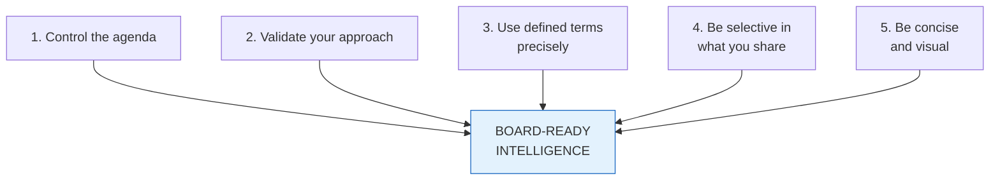
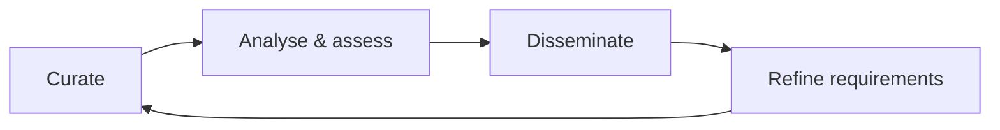
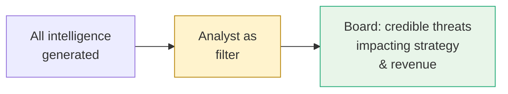

# Delivering Intelligence Reports to the Board

Reference for communicating threat intelligence to senior decision-makers so it is read, understood, and acted on. Even when the C-suite values intelligence in principle, attention is not automatic — boards are bombarded with briefings competing for the same hour.

For navigation see [top-level index](../01_Introduction_to_Threat_Intelligence/00_INTRODUCTION.md). For analyst-side framing see [Intelligence Confidence Language](../06_Intelligence_Confidence_and_Enterprise_Risk_Modelling/13_INTELLIGENCE_CONFIDENCE_LANGUAGE.md).

## The Problem

Boards may perceive intelligence as **tactical** rather than **strategic** — pushing it out of their sphere of responsibility. Even when it's framed strategically, the format and content can lose them. A common failure mode: an over-simplified colour-coded risk chart that turns amber/green for months, with no real-world threats described, becomes background noise.

## Five Keys

### 1. Control the Agenda

When senior decision-makers don't see a clear plan, they hijack the agenda — *"I read about DDoS — we need to look into that urgently!"* — derailing real priorities with random media-driven concerns.

**Counter:** demonstrate that operations are **intelligence-led**, not reactive. Anchor on a **threat profile** and a **prioritised plan**. The board should see what's most important and *why*, leaving no vacuum for ad-hoc agenda hijacking.

A baseline threat assessment is the artefact that makes this visible.

### 2. Validate Your Approach

Boards are data-driven. Where possible, show **numbers** demonstrating impact. Where numbers don't exist, show that hunting is **methodological**, not improvised — a repeatable cycle:

A repeatable cycle reassures the board, deepens their understanding, and lets you showcase real wins (a complete threat-landscape view, mitigated risks, focused management of priority threats).

### 3. Use Well-Defined Intelligence Terms Precisely

Security professionals are immersed in terminology that's foreign to many directors. *Threat* vs *risk* vs *vulnerability* — *high* vs *medium* — these terms must be **explicitly defined** or they become noise.

The cautionary example: a CSO who sent monthly colour-coded charts to his board. With no explanations of what red, amber, or green meant in real-world terms, the chart **over-simplified a complex issue** and lost the board's attention entirely.

**Counter:** use precise, carefully defined, **consistent** language. Where probability matters, use the [Sherman–Kent confidence scale](../06_Intelligence_Confidence_and_Enterprise_Risk_Modelling/13_INTELLIGENCE_CONFIDENCE_LANGUAGE.md). Where risk levels are reported, define what each level signifies in operational and business terms.

### 4. Be Selective in What You Share

Hunting threats produces huge amounts of intelligence. **What you share is the most important decision.**

The board wants items that concern **credible threats potentially impacting business strategy and revenue-generating opportunities**. They aren't interested in tactical items essential to your job but irrelevant to theirs.

### 5. Be Concise and Visual

Directors get thick board packs. Long, text-heavy reports are skimmed or skipped.

- Lead with a **summary of the most important points** — if they read nothing else, they have what they need.
- Use **maps, charts, and infographics** — eye-catching, easy to absorb, easy to update.
- Show **strategic-level connections** (e.g., business objectives ↔ threat groups opposing them).
- Build **consistent baseline graphics** that get updated each cycle, with text explaining what changed and why.

## Anti-Patterns

| Mistake | Why it fails |
|---------|--------------|
| Colour-coded chart with no definitions | Over-simplifies; offers no real context |
| Reacting to media-driven priorities | Surrenders the agenda; signals "no plan" |
| Tactical operational detail | Wrong altitude for board audience |
| Long text-heavy reports | Won't be read |
| Vague terminology (*"high risk"* with no anchor) | Becomes noise |

## Key Points

- Intelligence reports must be **strategic, methodological, and visual** to land with the board.
- Control the agenda with a clear, prioritised threat profile.
- Validate your approach with numbers or visible methodology.
- Use precisely defined language — assume directors don't share security vocabulary.
- Filter aggressively: share only what affects strategy and revenue.
- Lead with a summary; lean on graphics; refresh consistently.

## See Also

- [Intelligence confidence language](../06_Intelligence_Confidence_and_Enterprise_Risk_Modelling/13_INTELLIGENCE_CONFIDENCE_LANGUAGE.md) — how to phrase certainty for executives.
- [Ransomware Reporting Reference](../01_Introduction_to_Threat_Intelligence/00_INTRODUCTION.md#ransomware-reporting-reference) — audience-tailored reporting examples.
- [Threat modelling for enterprise risk](../06_Intelligence_Confidence_and_Enterprise_Risk_Modelling/14_THREAT_MODELLING_FOR_ENTERPRISE_RISK.md) — PASTA in particular for board-level risk framing.
