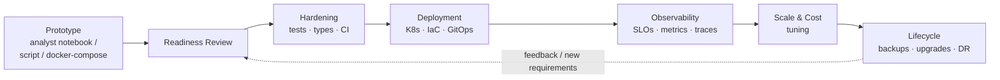
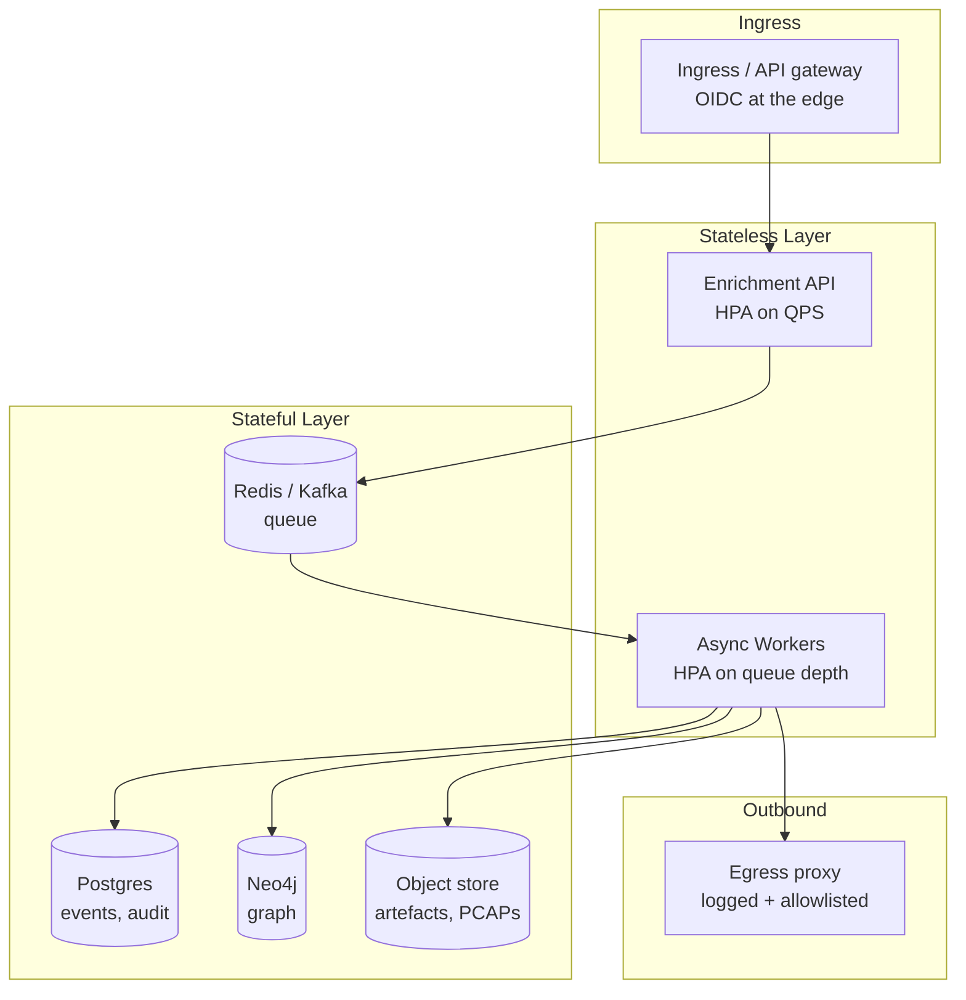

# Productionising Threat Intelligence Platforms

How an SRE / DevOps engineer takes a threat-intelligence prototype — TIP, MISP, ThreatConnect, Neo4j-backed graph, custom enrichment pipeline — and turns it into a **reliable, observable, production-grade service**.

This is the engineering counterpart to the analyst-facing notes in [02 Intelligence Collection](../02_Intelligence_Collection_and_Infrastructure/04_INTELLIGENCE_COLLECTION_METHODOLOGIES.md) and [05 Attribution](../05_Attribution/10_ATTRIBUTION_FRAMEWORKS.md).

---

## The Productionisation Journey

---

## 1. Prototype Readiness Review

Before promoting *anything* into production, score the prototype against a **readiness checklist**. This is what justifies the work plan — and pushes back on "it works on my laptop, ship it".

| Dimension | Question | Red flag |
|---|---|---|
| **Determinism** | Does it produce the same output for the same input? | Random seeds uncontrolled, time-of-day dependencies |
| **Idempotency** | Can it be re-run safely on the same data? | Side effects in side-effects (e.g. duplicate IOC inserts) |
| **Failure modes** | What happens if a feed times out? | `try / except: pass` |
| **Schema stability** | Are inputs/outputs typed? | Pandas `df.to_dict()` straight to Slack |
| **Secrets** | How are API keys handled? | `.env` committed, hardcoded tokens |
| **Data sensitivity** | Is victim/source data segregated? | TLP:RED data in shared logs |
| **Resource ceiling** | Memory / CPU / I/O bounds known? | "It needs the whole node" |
| **Test coverage** | Even smoke tests? | `# TODO: add tests` |

Output: a one-page **production-readiness scorecard** with a Green/Amber/Red verdict per dimension. Amber + Red items become the productionisation backlog.

---

## 2. Hardening the Codebase

The transition from "research code" to "service code".

### Code structure

- **Separate library from entrypoints.** A clean `src/<package>/` layout with a thin CLI / FastAPI layer at the top. Analysts can still import the library; ops can still run the service.
- **Typed everywhere.** `mypy --strict`, `pydantic` for boundaries (HTTP, queues, file inputs).
- **Pure functions where possible** so unit tests don't need fixtures or network.

### Dependencies

- Pin via `uv lock` / `poetry.lock`. Reproducible builds matter even more for security tooling.
- Run **SCA** (Software Composition Analysis) — `pip-audit`, Snyk, Dependabot. A vulnerable dep in a TIP is a different threat model than in a CRUD app.
- Watch out for **transitive scraping libraries** (BeautifulSoup, requests, Tor wrappers) that often pull in old or unmaintained code.

### CI gates

| Stage | Gate |
|---|---|
| Pre-merge | `ruff`, `mypy`, unit tests, `pip-audit` |
| Container build | Distroless / slim base, **non-root user**, `trivy fs` and `trivy image` |
| Pre-deploy | Integration tests against ephemeral MISP/Neo4j containers |
| Post-deploy | Smoke test (`/healthz`, sample IOC enrichment round-trip) |

> **Tip:** for security tooling, also add a **secret-scan** step (`gitleaks`, `trufflehog`) — your repo will inevitably contain example IOCs that *look* like leaks to scanners, so curate the allowlist.

---

## 3. Deployment Architecture

Patterns for the typical TIP component types:

### Component patterns

| Component | Pattern |
|---|---|
| **Enrichment API** | Stateless, behind an HPA. Cache hot lookups (Redis) — VirusTotal / RF rate limits will bite. |
| **Async workers** | Pull from a queue. Bound retries with **dead-letter queues**. Long-running tasks go to a separate pool with longer pod-disruption budgets. |
| **MISP** | Treat the official Docker image as starting point; externalise MySQL, Redis, attachments to managed services. **Don't** put MISP behind a shared ingress with public services — keep it on a private network with mTLS or a VPN. |
| **Neo4j** | Use the official Helm chart with **causal cluster** for HA. Persistent volumes on fast SSD. Dedicated read replicas for analyst queries; writes go to leader only. |
| **Object store** | Encrypted at rest. Signed URLs for analyst download. Lifecycle policies — old samples cost real money. |
| **Egress** | All outbound traffic through a logged, allow-listed proxy. You don't want your TIP itself becoming an exfil channel if compromised. |

### IaC + GitOps

- **Terraform** for the cloud account boundary (VPC, IAM, managed DBs).
- **Helm + ArgoCD** for the K8s layer. Drift detection becomes audit evidence.
- **Sealed Secrets / External Secrets Operator** for in-cluster secret material — see [Secrets and Access Control](18_SECRETS_AND_ACCESS_CONTROL.md).

---

## 4. Observability

Adapt your normal SRE observability to the **threat-intel domain**.

### SLOs that matter for a TIP

| SLO | Why it matters |
|---|---|
| **API availability** (e.g. 99.9% over 30d) | Standard. |
| **Enrichment latency p95 < 5 s** | If analysts wait, they go around the system. Direct quality impact. |
| **Feed freshness** (e.g. ≥ 1 ingest per source per 30 min) | A stale feed is worse than no feed — analysts trust it. |
| **Detection-rule push latency** | New IOC published → SIEM/EDR has it. End-to-end is the actual SLO. |
| **Queue depth headroom** | Spikes during incidents are normal; sustained backlog is not. |

### Dashboards (Grafana)

Three-tier dashboard set:

1. **Service health** — RED metrics, error budgets, queue depth.
2. **Intel KPIs** — enrichment volume, feed coverage, MISP events shared/consumed (the [Threat Intel KPIs](../06_Intelligence_Confidence_and_Enterprise_Risk_Modelling/13_INTELLIGENCE_CONFIDENCE_LANGUAGE.md) the CISO actually wants).
3. **Cost** — per-feed lookups, sandbox runs, storage growth. Threat intel can quietly become expensive.

### Logs and audit

- **Two log streams**: technical (stdout → ELK/OpenSearch) and **analyst audit** (who looked up which IOC, who exported which event).
- The audit stream has different retention and access rules — see [Secrets and Access Control](18_SECRETS_AND_ACCESS_CONTROL.md).
- **PII / victim data** must be either redacted in technical logs or routed to a separate, restricted index.

### Tracing

- Distributed traces from API → queue → worker → external feed → datastore.
- The single most useful trace span: **time-to-context** (when an IOC enters the system to when an analyst can see it enriched).

---

## 5. Scale & Cost Tuning

The dimensions that bite first:

| Pressure | Common cause | Lever |
|---|---|---|
| **Graph query latency** | Bloom users running unbounded `MATCH` | Read replicas, query budgets, cypher linters |
| **Vendor API spend** | Every analyst hits VirusTotal manually | Centralised cache + per-source budgets |
| **Object storage** | Sandbox PCAPs and dumps | Lifecycle policy, dedup by hash |
| **MISP write throughput** | Bulk imports during campaigns | Batch the ingest, async worker pool |
| **Sandbox concurrency** | Any.run / Joe seats | Queue + priority lanes |

> Build **per-source cost dashboards** early. "Why are we spending £40k/month on Recorded Future?" is a much better conversation when you can show usage by team.

---

## 6. Lifecycle: Backups, Upgrades, DR

For a security tool, **DR isn't optional** — losing your IOC history kills attribution timelines.

| Topic | Practice |
|---|---|
| **Backups** | Postgres + Neo4j daily snapshots to a separate account/region. Test restore quarterly — untested backups are folklore. |
| **MISP upgrades** | Pin versions; follow the [official upgrade guide](https://www.misp-project.org/) (verify URL before relying on it); test on staging with a snapshot of prod. |
| **Schema migrations** | Forward-only, with a rollback plan via restore. Never destructive. |
| **DR target** | Document RTO/RPO per component. The graph DB is usually the long pole. |
| **Tabletop** | Run a "what if our TIP is compromised" exercise alongside normal IR drills. |

---

## 7. Working with Analysts

The role-specific bit: this engineering work is *with* analysts, not *for* them.

- **Pair with analysts on prototypes early.** A Jupyter notebook that "just needs deploying" usually needs rewriting — easier to spot before it's three months of analyst muscle memory.
- **Expose escape hatches.** Analysts will always need a way to run an ad-hoc query, dump a CSV, hit an API directly. Plan for it; otherwise they'll build shadow pipelines.
- **Speak their language.** Cross-reference [confidence language](../06_Intelligence_Confidence_and_Enterprise_Risk_Modelling/13_INTELLIGENCE_CONFIDENCE_LANGUAGE.md) and [attribution frameworks](../05_Attribution/10_ATTRIBUTION_FRAMEWORKS.md) in your tool's UX.
- **OPSEC for the platform itself.** The TIP holds your collection sources and analyst notes — a compromise is a strategic leak. See [Secrets and Access Control](18_SECRETS_AND_ACCESS_CONTROL.md).

---

## Recap

- A **readiness scorecard** turns "is this productionable?" into a defensible work plan.
- **Hardening** is mostly the standard SRE playbook — but for security tooling, SCA and secret-scanning matter more, and outbound network policy is a load-bearing control.
- **Architecture patterns** for TIPs centre on stateless APIs + async workers + heavy stateful backends (Postgres, Neo4j, object store) behind a logged egress proxy.
- **SLOs** must include intel-specific signals (feed freshness, time-to-context) — pure availability isn't enough.
- **Observability** has a dual stream: technical and analyst audit, with different access rules.
- **Cost dashboards** by source/team turn vendor renewal conversations from gut-feel into evidence-based.
- **Backups, DR, and tabletop exercises** are non-negotiable for tools that hold attribution-relevant history.

> Cross-references: [Secrets and Access Control for Security Tooling](18_SECRETS_AND_ACCESS_CONTROL.md) · [LLM Agents and Agentic Workflows](17_LLM_AGENTS_AND_AGENTIC_WORKFLOWS.md)
