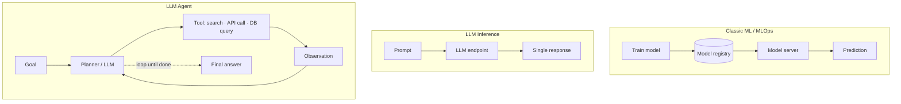
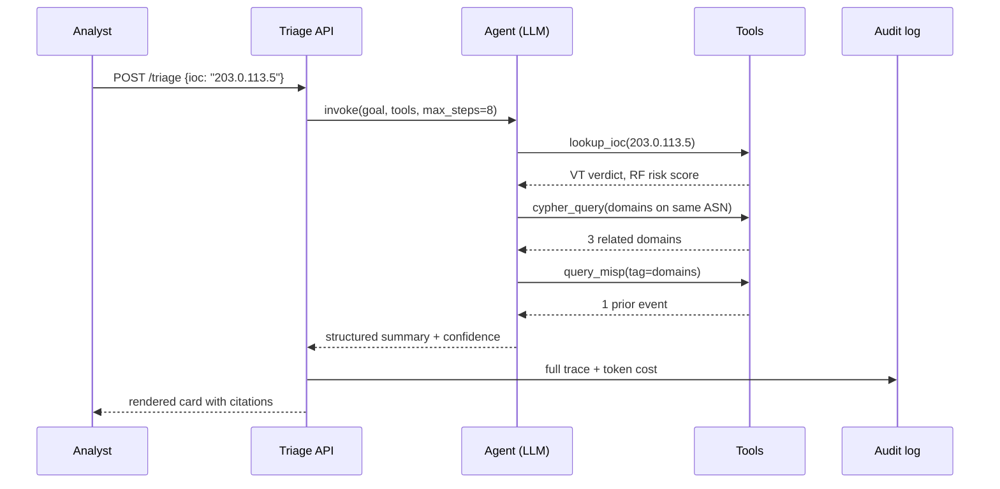

# LLM Agents and Agentic Workflows

A practical primer on **LLM agents** and **agentic workflows** for an engineer building threat-intelligence platforms — what they are, how they fit alongside traditional MLOps, and what to watch out for when shipping them as services.

The role's "AI/ML workflows **and agents**" line is what this doc maps to. Traditional model serving (training, registries, drift) is well-trodden ground; agents are newer and have different operational properties.

---

## Where Agents Sit in the AI/ML Stack

The key shift: an agent **runs in a loop**, deciding which tool to use next based on what it's seen so far. That single property changes deployment, observability, cost, and security.

---

## Core Concepts

### Tool use

The LLM is given a set of **tools** (typed functions) and chooses which to call. The host application executes the tool and returns the result, which the LLM uses to decide the next step.

Typical threat-intel tools an agent might be given:

- `lookup_ioc(value, type) → reputation`
- `query_misp(tag, since) → events`
- `cypher_query(query) → graph_subgraph`
- `summarise_pdf(url) → summary`
- `search_telegram_archive(keyword) → posts`

### ReAct / planner-executor loops

The most common pattern: **Reason → Act → Observe → repeat**. The LLM produces a thought, picks a tool, sees the output, then decides whether it has enough information.

### Context engineering (formerly "prompt engineering")

System prompts, tool descriptions, few-shot examples, output schemas. This is the **load-bearing config** of an agent — treat it like code: version it, test it, review changes.

### Memory

- **Short-term** — the conversation / scratchpad within a single run.
- **Long-term** — vector store or structured memory persisted across sessions.

For a CTI agent, long-term memory might be the analyst's case notes; the [audit considerations](16_PRODUCTIONISING_THREAT_INTEL_PLATFORMS.md#logs-and-audit) of those notes carry over.

### RAG (Retrieval-Augmented Generation)

The agent (or a non-agentic pipeline) retrieves relevant documents and feeds them into the prompt. In CTI, RAG over a curated corpus of vendor reports, ATT&CK descriptions, and your own past incidents is a high-value pattern.

---

## When to Use an Agent (and When Not To)

| Use an agent | Don't bother |
|---|---|
| Open-ended task with **unknown** number of steps (triage a new IOC) | Fixed pipeline (enrich every hash with VT + RF) — use a normal workflow |
| **Many possible tools**, choice depends on context | One tool, always called the same way — just call it |
| **Exploratory** analyst assistance | Real-time, latency-critical lookups |
| Synthesis across heterogeneous sources | Deterministic, auditable transformations |

> **Default to not using an agent.** Agents introduce non-determinism, higher cost, and harder evaluation. Reach for them only when the looping behaviour is genuinely the value.

---

## Operational Concerns (the SRE View)

This is where your existing SRE instincts apply differently.

### Latency and cost

- A single user request can fan out into **many** LLM calls. Tail latency is dominated by tool calls and LLM round-trips.
- **Token cost is the new compute cost.** Cache aggressively (prompt caching, response caching), bound max iterations, prefer smaller models for orchestration steps.
- Track **cost per task**, not per request — meaningful comparison across runs.

### Reliability

- Tool failures cascade. A flaky `lookup_ioc` means the agent retries, hallucinates, or gives up — none are good.
- Patterns: **bounded retries**, **circuit breakers per tool**, **structured error returns** the LLM can reason about ("rate limited, retry in 30s").
- **Max-step limits** prevent runaway loops. Always set them.

### Determinism and reproducibility

- Even with `temperature=0`, model versions change. Pin models. Snapshot prompts and tool schemas alongside code.
- **Replayable runs** — log the full trace (prompts, tool calls, responses) so an analyst can audit why a decision was made.

### Observability

Borrowed from your existing stack, plus a few new signals:

| Signal | What it tells you |
|---|---|
| **Tokens in / out per run** | Cost driver |
| **Steps per run** | Agent confused or hitting loops? |
| **Tool call distribution** | Is one tool dominating? Is one never picked? |
| **Tool error rate** | Cascades into agent quality |
| **LLM provider latency p50/p95/p99** | Often the biggest contributor |
| **Eval scores over time** | Regression detection |

LangSmith, Langfuse, and OpenTelemetry's GenAI conventions all give you traces of agent runs. Pick one and stick with it.

### Evaluation

You can't deploy what you can't evaluate. For agents:

- **Golden tasks** — a fixed set of inputs with known-good outputs. Run on every change.
- **LLM-as-judge** — careful, can lower the bar by agreeing with itself; use with guardrails.
- **Human review** — sample a percentage of production runs for analyst sign-off.

> Treat eval as part of CI. A prompt change without an eval run is a prod change without a test.

---

## Agent-Specific Security Concerns

Agents are a **new attack surface** — particularly relevant when the agent reads adversary-controlled data (which a CTI agent does by definition).

| Threat | Mitigation |
|---|---|
| **Prompt injection** — adversary plants instructions in a phishing PDF, sandbox report, telegram post the agent reads | Treat all retrieved content as **untrusted**. Wrap in clear delimiters, instruct the model to ignore instructions inside data, validate outputs against schemas, **don't give the agent destructive tools** without human approval. |
| **Tool poisoning** — an attacker influences a feed the agent's tool reads from | Sign feeds where possible; cross-reference; downgrade confidence as per [confidence language](../06_Intelligence_Confidence_and_Enterprise_Risk_Modelling/13_INTELLIGENCE_CONFIDENCE_LANGUAGE.md). |
| **Excessive agency** — agent has tools that mutate state (block IPs, push detection rules) | **Human-in-the-loop** for any state-changing tool. Audit every call. |
| **Data exfiltration via tool calls** | Egress proxy (see [productionisation note](16_PRODUCTIONISING_THREAT_INTEL_PLATFORMS.md)) — even the agent's outbound calls go through it. |
| **Sensitive data in prompts** | TLP-aware redaction before content reaches the LLM API. See [Secrets and Access Control](18_SECRETS_AND_ACCESS_CONTROL.md). |
| **Model output as code** — agent writes Cypher, executes it | Sandbox; allowlist query patterns; never `eval` LLM output. |

---

## A Reference Pattern: Triage Agent

Concrete sketch of a CTI triage agent that takes a fresh IOC and produces an enriched, contextualised summary for an analyst.

What's load-bearing in this pattern:

- **Structured output** — the agent's final answer is a typed object, not free text. Easier to render, easier to audit.
- **Citations** — every claim links back to a tool call. Otherwise it's a black box.
- **Confidence-scored** — uses the same [Sherman–Kent vocabulary](../06_Intelligence_Confidence_and_Enterprise_Risk_Modelling/13_INTELLIGENCE_CONFIDENCE_LANGUAGE.md) as the rest of the org. The agent should be **constrained to that vocabulary** in its output schema.
- **Human review** — the analyst sees the card *and* can drill into the trace.

---

## Tooling Landscape

| Layer | Options |
|---|---|
| **Agent frameworks** | LangChain / LangGraph, LlamaIndex, Anthropic's Agent SDK, Pydantic AI |
| **LLM providers** | Anthropic (Claude), OpenAI, Bedrock, Vertex, self-hosted via vLLM |
| **Vector stores** | pgvector (often enough), Qdrant, Weaviate |
| **Eval / observability** | LangSmith, Langfuse, OpenTelemetry GenAI, custom |
| **Prompt versioning** | Git, or dedicated tools like Promptfoo, Helicone |

The framework you pick matters less than discipline around versioning, evals, and traces. **Agents without traces are unmaintainable.**

---

## Recap

- An agent is an LLM **looping** with tools — that single property reshapes deployment, cost, and security.
- **Default to not using one**; reach for agents only when the loop is the value.
- **Token cost is the new compute cost** — cache, cap iterations, monitor cost per task.
- **Prompts and tool schemas are code** — version, review, test with golden eval sets.
- **Prompt injection is the load-bearing security concern** for CTI agents because they read adversary-controlled data.
- A triage-agent pattern with **structured output + citations + confidence-scored vocabulary** is a strong default for CTI workflows.

> Cross-references: [Productionising Threat Intel Platforms](16_PRODUCTIONISING_THREAT_INTEL_PLATFORMS.md) · [Secrets and Access Control](18_SECRETS_AND_ACCESS_CONTROL.md) · [Intelligence Confidence Language](../06_Intelligence_Confidence_and_Enterprise_Risk_Modelling/13_INTELLIGENCE_CONFIDENCE_LANGUAGE.md)
