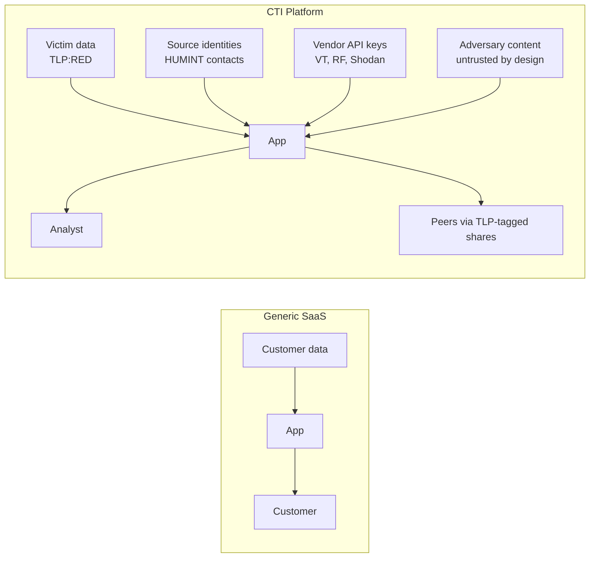
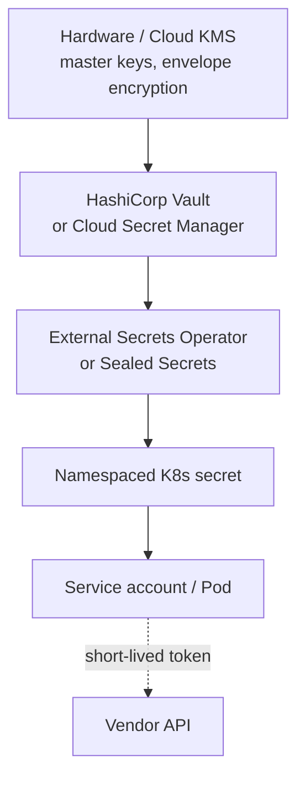
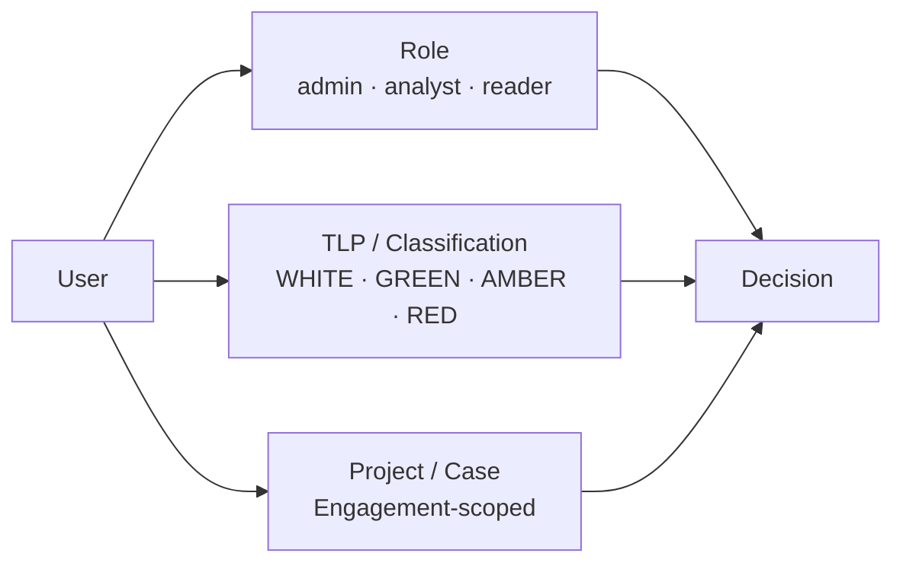

# Secrets and Access Control for Security Tooling

Threat-intelligence platforms are an **unusually high-value target** in their own right: they hold collection sources, victim metadata, ongoing investigations, and the relationships analysts have built with peers. A compromise isn't just an outage — it's a **strategic intelligence loss**.

This note covers the secrets-management and access-control patterns that go beyond a generic web service.

The general SRE basics (Vault, OIDC, mTLS) are assumed. Focus here is on **what's different for security tooling**.

---

## What Makes This Different from Generic Apps

A CTI platform mixes:

- **Victim data** — sensitive, often TLP:RED.
- **Source identities** — exposing a HUMINT source can endanger the source.
- **Commercial vendor secrets** — VirusTotal Enterprise, Recorded Future, premium feeds. Often **per-seat-licensed**, so leaked keys aren't just a cost issue, they violate terms.
- **Adversary content** — by design you ingest things attackers wrote. Must never be trusted as instructions or executed.

The blast radius of any leak is bigger than for a generic app. Build accordingly.

---

## Secrets Management

### Layered approach

### Practices

| Concern | Practice |
|---|---|
| **No long-lived static keys in code or images** | Inject at runtime via Vault / cloud secret manager. Pods get short-lived tokens; tokens get short-lived API creds. |
| **Per-tenant / per-team scoping** | A worker enriching for Team A doesn't need Team B's RF key. Scope at the secret level, not the cluster level. |
| **Workload identity over service-account keys** | IRSA on EKS, Workload Identity on GKE, Azure AD pod identity. Eliminates the worst foot-gun. |
| **Rotation** | Automated, scheduled, tested. Vendor keys often *can* rotate via API — wire it up. Document the manual fallback for ones that can't. |
| **Break-glass access** | Documented, audited, alerts on use. Never the daily path. |
| **Secret-scanning in CI** | `gitleaks`, `trufflehog`. Allowlist your test fixtures (which contain example IOCs that look secret-shaped). |
| **Quarantine compromised keys instantly** | One-command rotation runbook. The hardest part is usually the post-rotation hunt for stale references in dashboards/scripts. |

### Special case: vendor API keys

These are the secrets most likely to leak (used in many places, often shared across services).

- **Centralise vendor calls** behind a single internal service that holds the key. No worker calls VirusTotal directly.
- **Rate-limit and budget per caller** — your gateway, not the vendor, enforces it.
- **Log every call** with a caller identity. Cost attribution + abuse detection in one move.

---

## Authentication

### For analysts (humans)

- **OIDC / SAML** to your IdP (Okta, Entra ID, Workspace). One identity, MFA, conditional access.
- **No local accounts** in MISP / ThreatConnect / Neo4j / dashboards. Disable, then verify.
- **Session lifetimes** shorter than for generic SaaS — analysts often access multiple tools in one workflow; force re-auth at sensible boundaries (e.g. crossing TLP:RED data).
- **Hardware-backed MFA** (WebAuthn / FIDO2) for any account that can export data or modify detection rules.

### For services (machine-to-machine)

- **mTLS** between services in the cluster. Service mesh (Istio, Linkerd) makes this default.
- **OAuth client-credentials** with short-lived tokens for cross-service calls.
- **No shared service accounts.** Per-service identity, scoped permissions.

### For peers / external partners

- **Per-partner credentials** with their own scopes — never share a single TIP key across partners.
- **TLP-aware** sharing: a partner with TLP:GREEN access can never see TLP:AMBER content, enforced at the API.
- **Time-boxed** access where the engagement is finite (e.g. an incident-response collaboration).

---

## Authorisation

### Beyond simple RBAC

Standard RBAC ("admins / users / readonly") is too coarse for a CTI platform. You need at least three orthogonal axes:

| Axis | What it controls |
|---|---|
| **Role** | What kinds of action (create event, edit, share, admin) |
| **TLP / classification** | What content the user can even see |
| **Project / case** | Which investigation's data is in scope |

A junior analyst on Project Bravo with TLP:AMBER clearance can *edit events tagged Project Bravo at TLP:AMBER or below* — not Project Alpha's TLP:RED data. ABAC (attribute-based access control) is the common implementation pattern.

### TLP-aware enforcement

- The TLP marking is a **first-class attribute** on every event, indicator, file, and log line.
- API and UI **filter at the source** — never rely on the UI to hide content.
- **Logs and audit streams are also TLP-tagged**. A technical log that contains a TLP:RED IOC must route to the restricted log index, not the general one.
- **Exports** (CSV, PDF, MISP push) re-check TLP at the boundary and watermark accordingly.

### Source protection

The hardest case: an analyst's report references a HUMINT source by handle.

- Source identities live in a **separate, more-restricted store**, referenced by token.
- The general TIP shows the token; only a small group can resolve it to the identity.
- All resolutions are logged, alerted on unusual patterns, and reviewable by a source-handler.

---

## Audit Logging

A separate, **append-only** audit stream — not the same as your technical logs.

| Property | Why |
|---|---|
| **Append-only / WORM** | If logs can be edited, they can't be evidence. Object-lock buckets, dedicated DB with restricted writers. |
| **Distinct retention** | Often 1-7 years vs 30-90 days for technical logs. Compliance-driven. |
| **Distinct access control** | A small group reads audit. Even admins shouldn't have write. |
| **Tamper detection** | Hash chains or signed entries. Detect after-the-fact edits. |
| **What to log** | Auth events, exports, secret reads, role changes, TLP downgrades, source-handle resolutions, agent tool calls, every IOC lookup. |

> A useful test: *"If an insider exfiltrated everything tonight, would tomorrow's audit log let us reconstruct it?"* If not, you're missing events.

---

## OPSEC for the Platform Itself

The platform is **adversary-relevant infrastructure**. Treat it accordingly.

| Concern | Practice |
|---|---|
| **Egress** | All outbound through a logged, allow-listed proxy. Adversary infra you research must not learn your origin IP. |
| **DNS leakage** | Don't resolve adversary domains from your corporate resolver. Use a sinkhole / passive DNS / vendor lookup that doesn't beacon. |
| **Sandbox detonation** | Never on shared corporate network. Dedicated environment, separate cloud account, no return path to prod. |
| **Tor / dark-web access** | Documented legal review. Dedicated identities. Never shared with analyst SSO. |
| **Browser isolation** for analyst research | Remote browsing or a dedicated VM. A drive-by on an analyst workstation is a serious incident. |
| **Source code & infra repos** | Private. Branch protection. Reviewed. Threat-intel scripts often contain IOCs that, if mishandled, look like attacker artefacts to other tools. |

---

## Compliance Touchpoints

Common frameworks that intersect:

- **SOC 2 / ISO 27001** — general controls, audit, change management.
- **GDPR / regional privacy law** — relevant when victim data includes EU subjects, or when sharing across borders.
- **TLP** — not legally binding but operationally critical; treat as a control framework.
- **Sector-specific** — FS-ISAC, H-ISAC, etc. — partner-specific handling rules.

For each: map controls to existing platform features rather than building bespoke. Most are satisfied by the audit and access patterns above.

---

## Recap

- CTI platforms have a **larger blast radius** on compromise than generic apps — victim data, source identities, vendor keys, adversary-influenced content all in one place.
- **Layered secrets management** with workload identity, scoped per team/tenant, and centralised vendor-API gateways.
- **OIDC + hardware MFA** for analysts; **mTLS + workload identity** for services.
- Authorisation needs **three axes** — role, TLP/classification, project — implemented as ABAC.
- **Source protection** lives in a separate, more-restricted store, referenced by token, with every resolution audited.
- **Audit logs are separate from technical logs** — append-only, longer retention, distinct access.
- Treat the platform as **adversary-relevant infrastructure** — egress, DNS, sandboxing, browser isolation all matter.

> Cross-references: [Productionising Threat Intel Platforms](16_PRODUCTIONISING_THREAT_INTEL_PLATFORMS.md) · [LLM Agents and Agentic Workflows](17_LLM_AGENTS_AND_AGENTIC_WORKFLOWS.md) · [Intelligence Confidence Language](../06_Intelligence_Confidence_and_Enterprise_Risk_Modelling/13_INTELLIGENCE_CONFIDENCE_LANGUAGE.md)
