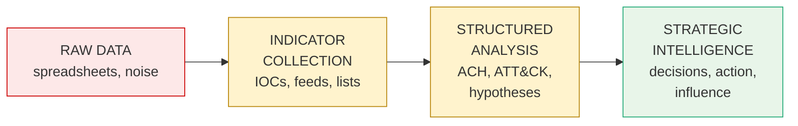
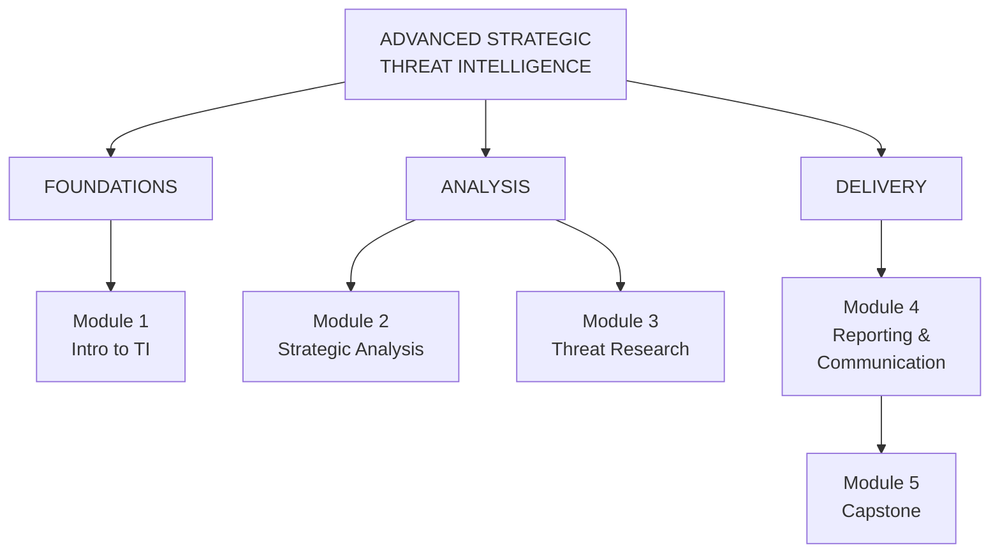
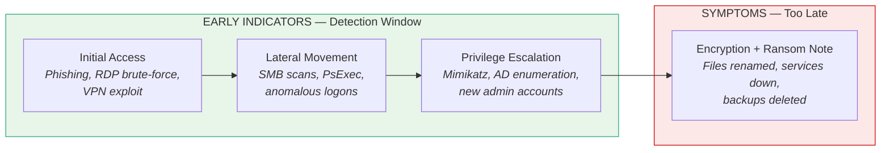
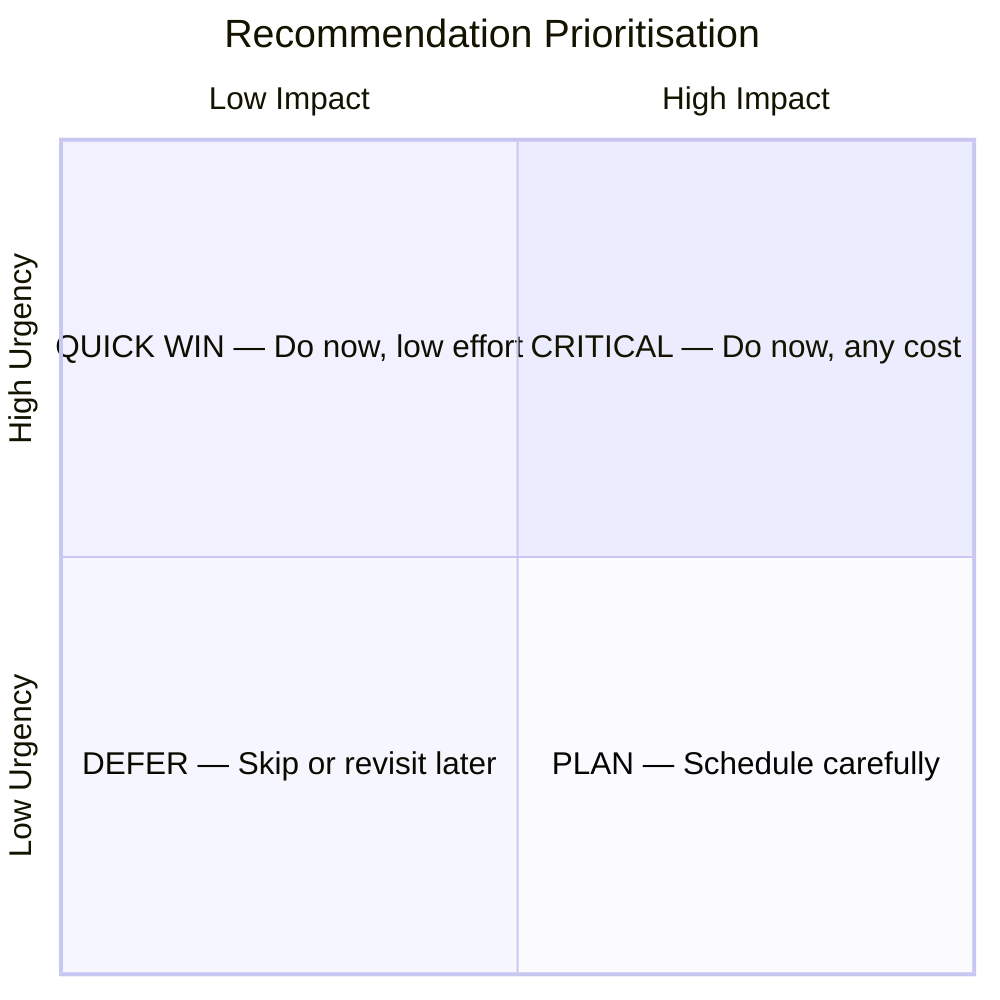
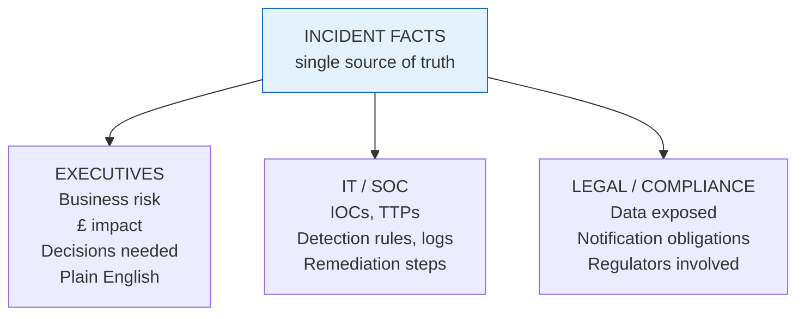

# Advanced Strategic Threat Intelligence Research & Reporting

## Welcome

Welcome to **Advanced Strategic Threat Intelligence Research & Reporting**. In this course, you'll learn how to identify, analyse, and respond to evolving cyber threats. You'll focus on advanced threat intelligence techniques, including data collection, analysis of threat actors, and malware correlation, using frameworks like **MITRE ATT&CK** and **NIST 800-53**.

Through expert instruction, real-world case studies, and hands-on exercises, you'll gain the skills to interpret intelligence from multiple sources, assess risks, and develop strategic reports. By the end of this course, you'll be equipped to protect your organisation from cyber threats, communicate findings effectively, and lead proactive defence initiatives across your business.

---

## Why This Course

> *Have you ever felt like you were piecing together a massive puzzle — only someone scattered half the pieces across the dark web?*

That's threat intelligence: complex, fast-paced, and often frustrating. The challenge today is that analysts are **overwhelmed with raw data but lack the tools to transform it into strategic intelligence**.

This course is the roadmap to move from collecting indicators to producing high-impact intelligence that drives real decisions.



> Most analysts get stuck at indicator collection or structured analysis. **This course gets you to strategic intelligence.**

Whether you're an aspiring threat analyst or a seasoned professional, this course will help you sharpen research strategy, strengthen analysis, and refine reporting for maximum impact:

- **Analyse** threat actor infrastructure, malware, and TTPs across campaigns.
- **Map and correlate** activity using leading frameworks and tools.
- **Assess** intelligence confidence and communicate uncertainty effectively.
- **Create** advanced, stakeholder-focused intelligence reports that drive decisions.

---

## About Your Instructor

**Monica McIntyre** brings 30 years of IT experience and 15 years across government, private sector, and consulting roles in cyber threat intelligence. She holds multiple certifications including **CISSP** and a master's degree in cybersecurity.

Her path into threat intelligence began unusually: she was the victim of a state-sponsored phishing attack that compromised her global domain administrative account. The incident was investigated and she was cleared of involvement — but it sparked a lifelong passion for cybersecurity, and her love of detective work made threat intelligence analysis a natural fit.

Across her career as a cyber auditor, vulnerability manager, information security officer, and consultant, she has seen many breaches that could have been prevented with proper security controls, solid tooling, and well-trained analysts who can collate indicators of compromise into actionable intelligence. The experience of moving from drowning in spreadsheets and IOCs to applying structured analysis, repeatable methodologies, and clear communication is the journey this course is built around.

---

## Target Learners

This course is ideal for:

- **IT and cybersecurity professionals** — looking to elevate their skills in threat detection, incident response, and security architecture.
- **CISOs and security leaders** — aiming to update their strategies for managing evolving threats.
- **Business executives (CEOs and senior leaders)** — who need to understand cybersecurity risks and compliance.
- **Cybersecurity analysts** — seeking advanced investigative and analytical techniques for career growth.

---

## Prerequisites

Participants should have:

- A beginner-level understanding of IT or cybersecurity.
- Familiarity with basic networking and security concepts.

Certifications like **A+**, **Network+**, or **Security+** are helpful but not mandatory. The course builds on foundational knowledge and is accessible to those with some prior experience.

---

## Course Structure



---

## Modules

### Module 1 — Introduction to Threat Intelligence
*[Link to be added]*

Embed security directly into your applications and development processes. Explore **Secure by Design** principles, secure coding techniques, and secure configuration practices to prevent critical vulnerabilities. Through practical demonstrations, static and dynamic application security testing, and runtime protection strategies, you'll develop the skills to identify, mitigate, and manage vulnerabilities throughout the software development lifecycle. Aligned with **OWASP Top 10** and **SANS Top 25**.

### Module 2 — Strategic Analysis, Attribution & Threat Modelling
*[Link to be added]*

Analyse, attribute, and model cyber threats using structured, evidence-based intelligence techniques. Work with methods like **ACH (Analysis of Competing Hypotheses)**, red teaming, and scenario modelling to evaluate adversary behaviour, identify analytical biases, and communicate confidence levels clearly. Build strategic threat models using **STRIDE**, **ATT&CK**, and **NIST 800-30**.

### Module 3 — Threat Research, Correlation & Infrastructure Mapping
*[Link to be added]*

Perform advanced threat research, correlate complex attack indicators, and map adversary infrastructure across multiple data sources. Explore collection planning, **OSINT** tradecraft, malware analysis workflows, and behavioural fingerprinting techniques to uncover patterns. Use hands-on tools, graph analytics, and real-world case studies to connect campaigns and build accurate intelligence assessments.

### Module 4 — Reporting and Communication of Intelligence
*[Link to be added]* — **(this session)**

Turn complex technical threat intelligence into clear, actionable insights tailored for different audiences. Practise structuring reports, communicating uncertainty with confidence, and presenting intelligence in formats suited for executives, SOC teams, legal stakeholders, and board members.

### Module 5 — Course Conclusion (Capstone)
*[Link to be added]*

Apply everything you've learnt by analysing a simulated threat actor campaign and turning raw intelligence into a stakeholder-ready brief. Correlate indicators across multiple sources, assess risk and confidence levels, and use structured analysis and reporting techniques to deliver actionable insights.

---

## Tools & Frameworks You'll Use

Throughout the course you'll roll up your sleeves and work hands-on with industry-standard tools, mapped to the phase of intelligence work they support.

```
   PHASE                        TOOLS / FRAMEWORKS
   ─────                        ──────────────────

   ┌────────────────────┐       VirusTotal
   │ Malware &          │  ───  AnyRun
   │ Behaviour Analysis │
   └────────────────────┘

   ┌────────────────────┐       Shodan
   │ Infrastructure     │  ───  PassiveDNS
   │ Mapping            │
   └────────────────────┘

   ┌────────────────────┐       MITRE ATT&CK
   │ Structured         │  ───  ACH (Analysis of
   │ Analysis           │        Competing Hypotheses)
   └────────────────────┘

   ┌────────────────────┐       Reporting templates
   │ Stakeholder-Ready  │  ───  Modern reporting
   │ Outputs            │        tools
   └────────────────────┘
```

---

## Learning Outcomes

By completing this course, you will be able to:

1. **Differentiate** between data, intelligence, threats, and threat impacts, and identify reliable sources for threat data collection.
2. **Design and execute** structured intelligence research plans.
3. **Correlate and enrich** indicators with strategic context, applying intelligence collection methods to analyse threat infrastructure and validate malware data.
4. **Evaluate** threat hypotheses across multiple sources using ACH and analytic techniques, and conduct risk assessments to prioritise threats to enterprise infrastructure.
5. **Build and deliver** tailored, strategic intelligence reports for different audiences — communicating findings with confidence and clarity through data storytelling.

---

## Tips for Learners

- **Stay engaged** in the hands-on labs and apply what you learn in practical, real-world scenarios.
- **Develop structured thinking** when analysing threats — take time to consider all angles and evidence.
- **Practise communicating** technical findings clearly, especially when translating complex intelligence into accessible insights for decision-makers.
- **Collaborate with peers**, especially during case study analysis and lab exercises — peer feedback is invaluable.

> Turn threat intelligence into strategic power and help your organisation stay ahead of adversaries.

---

## A Final Word Before You Begin

This course isn't just about frameworks and tools. It's about learning to **think like a strategist**, **communicate with clarity**, and **grow as an intelligence professional**.

You're not alone on this journey — you'll be guided step-by-step as you develop the skills to move beyond reactive analysis and become a trusted intelligence advisor. Let's make this a transformative learning experience.

---

# Session Notes — Module 4: Reporting & Communication

## Session Overview

This session covered how to analyse a ransomware campaign, correlate findings, and report them effectively to different stakeholders. The focus was on four core competencies:

1. Understanding the threat
2. Connecting technical findings to business impact
3. Developing prioritised recommendations
4. Tailoring communication for different audiences

---

## Key Lessons Learnt

### 1. Differentiating Symptoms from Early Indicators

A critical lesson: the **symptoms** of a ransomware attack (e.g., encrypted files, ransom notes) are not the same as the **earlier technical indicators** that can help detect the attack while it is still in progress.



**Rule of thumb:** detection efforts should focus on the left side of the timeline. By the time symptoms appear, recovery — not prevention — is the only option.

---

### 2. Connecting Technical Findings to Business Impact

Technical findings need to be translated into language that non-technical stakeholders can act on.

```
  TECHNICAL FINDING                       BUSINESS IMPACT
  ─────────────────                       ───────────────

  Encrypted file servers          ───▶    Operations halted, revenue loss
  Exfiltrated customer DB         ───▶    Regulatory fines, brand damage
  Backup systems compromised      ───▶    Recovery cost / time multiplied
  AD domain controller breach     ───▶    Full enterprise trust failure
```

---

### 3. Prioritising Recommendations

Recommendations should be structured by urgency and impact, not just listed.



---

### 4. Tailoring Communication for Different Audiences

The same incident must be reported differently depending on the audience.



---

## Personal Feedback from the Session

### Strengths
- Strong understanding of both technical indicators of compromise and their broader business implications.
- Well-structured and prioritised recommendations for incident response and mitigation.

### Areas for Improvement
- Differentiate between the **symptoms** of a ransomware attack and the **earlier technical indicators** that can help detect it in progress. Detection lives upstream of symptoms.

---

## Takeaway

Effective ransomware response analysis is not just about identifying what happened — it is about catching it earlier, framing it for the right audience, and turning findings into action.
