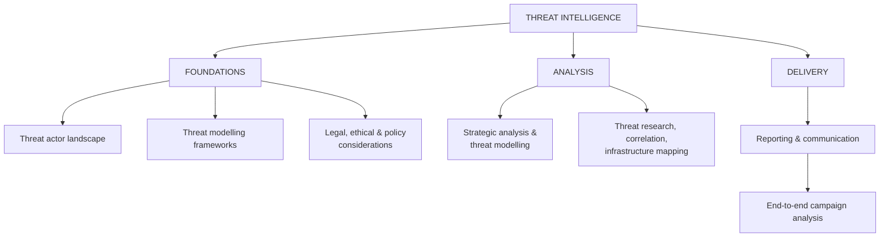
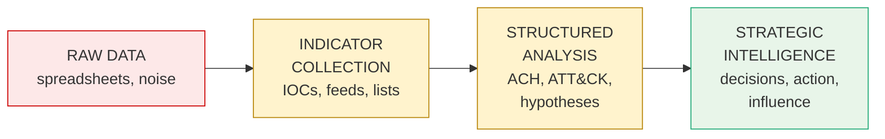
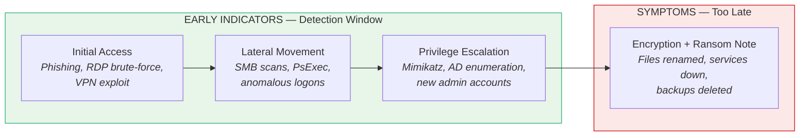
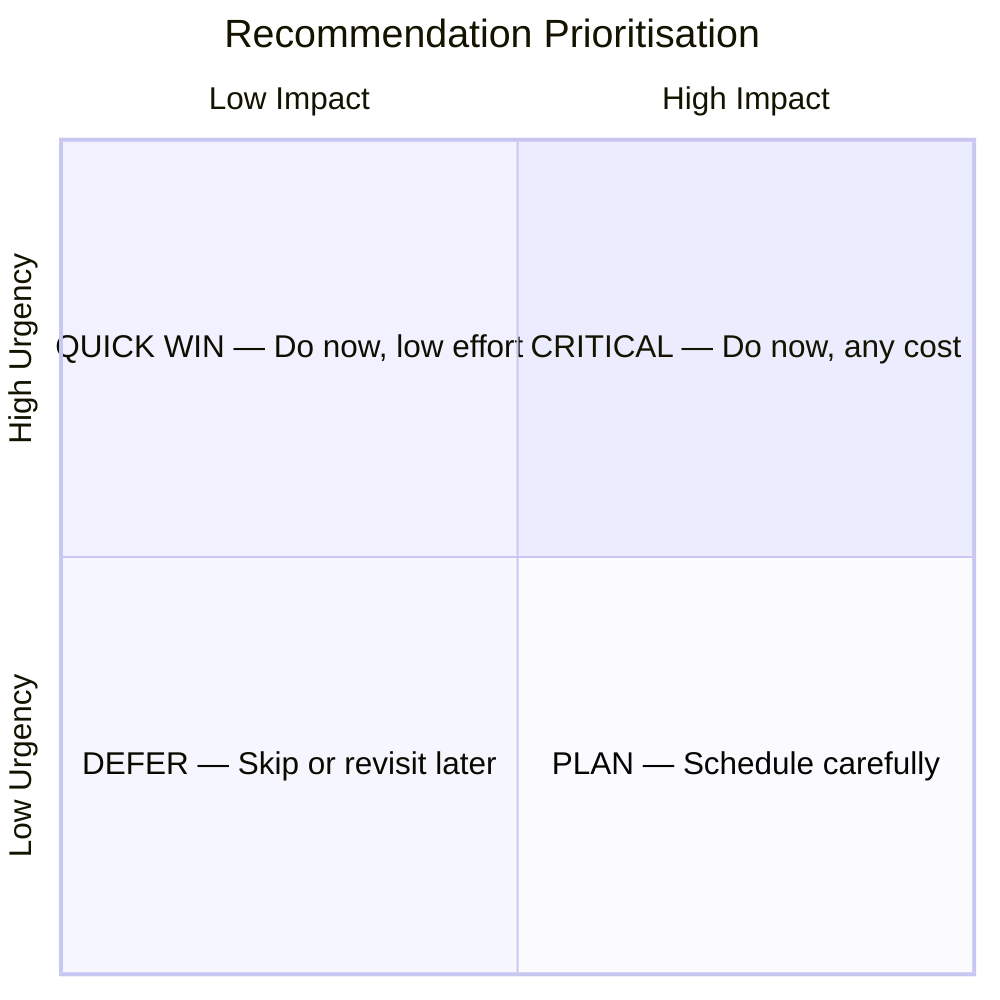
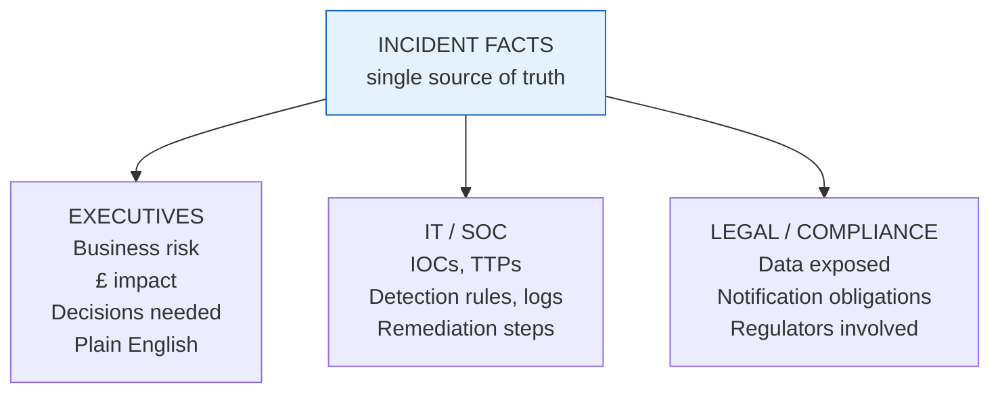

# Threat Intelligence — Reference Overview

Reference material on advanced threat intelligence: research, analysis, attribution, and reporting. This document is the top-level index; topic detail lives in the linked documents.

## Topic Index



| Topic | Reference |
|-------|-----------|
| Threat actor categories, motivations, attribution, confidence levels | [THREAT_ACTOR_LANDSCAPE.md](./THREAT_ACTOR_LANDSCAPE.md) |
| Threat modelling frameworks (MITRE ATT&CK, Diamond, Cyber Kill Chain, STRIDE, PASTA) | [THREAT_MODELLING_FRAMEWORKS.md](./THREAT_MODELLING_FRAMEWORKS.md) |
| Legal, ethical & policy considerations (GDPR, CCPA, OSINT ethics, NIST 800-53/61) | [LEGAL_ETHICAL_AND_POLICY.md](./LEGAL_ETHICAL_AND_POLICY.md) |
| Strategic analysis & threat modelling (NIST 800-30, ACH) | *to be added* |
| Threat research, correlation, infrastructure mapping (OSINT, malware analysis, behavioural fingerprinting) | *to be added* |
| Reporting & communication | See [Ransomware Reporting Reference](#ransomware-reporting-reference) below |
| End-to-end campaign analysis | *to be added* |

---

## The Intelligence Maturity Spectrum



Most analysts operate at indicator collection or structured analysis. Strategic intelligence is the output stage where assessments drive decisions.

---

## Frameworks & Tools Quick Reference

| Purpose | Tool / Framework |
|---------|------------------|
| Malware & behaviour analysis | VirusTotal, AnyRun |
| Infrastructure mapping | Shodan, PassiveDNS |
| Structured analysis | MITRE ATT&CK, ACH (Analysis of Competing Hypotheses) |
| Multidimensional intrusion analysis | Diamond Model |
| Attack lifecycle tracking | Cyber Kill Chain |
| Stakeholder-ready outputs | Reporting templates, modern reporting tools |
| Ethical & legal guardrails | GDPR, CCPA, NIST 800-53, NIST 800-61 |

For framework comparison and the Diamond Model in detail, see [THREAT_MODELLING_FRAMEWORKS.md](./THREAT_MODELLING_FRAMEWORKS.md).

---

# Ransomware Reporting Reference

Reference for analysing a ransomware campaign and reporting findings to different stakeholders. Four core competencies:

1. Understanding the threat
2. Connecting technical findings to business impact
3. Prioritising recommendations
4. Tailoring communication for different audiences

## Symptoms vs Early Indicators

The **symptoms** of a ransomware attack (encrypted files, ransom notes) are not the same as the **earlier technical indicators** that allow detection while the attack is still in progress.



Detection effort belongs on the left side of the timeline. Once symptoms appear, recovery — not prevention — is the only option.

## Technical Findings → Business Impact

Technical findings need to be translated into language that non-technical stakeholders can act on.

```
  TECHNICAL FINDING                       BUSINESS IMPACT
  ─────────────────                       ───────────────

  Encrypted file servers          ───▶    Operations halted, revenue loss
  Exfiltrated customer DB         ───▶    Regulatory fines, brand damage
  Backup systems compromised      ───▶    Recovery cost / time multiplied
  AD domain controller breach     ───▶    Full enterprise trust failure
```

## Recommendation Prioritisation

Recommendations are structured by urgency and impact, not listed flat.



## Audience-Tailored Communication

The same incident is reported differently depending on the audience.



## See Also

- [Threat actor types and attribution](./THREAT_ACTOR_LANDSCAPE.md) — categories of actors and how attribution works.
- [Threat modelling frameworks](./THREAT_MODELLING_FRAMEWORKS.md) — MITRE ATT&CK, Diamond Model, Cyber Kill Chain, STRIDE, PASTA.
