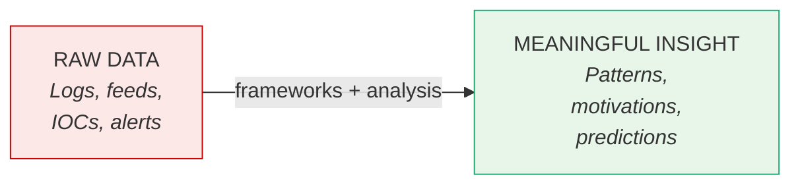
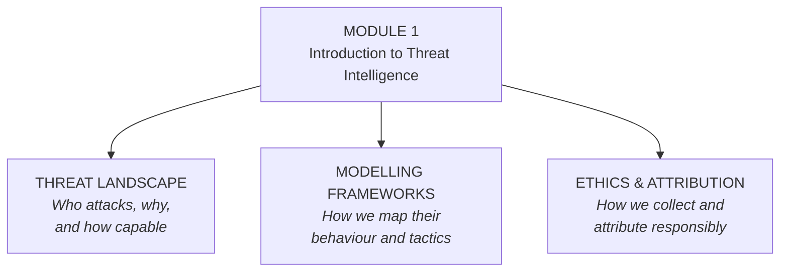
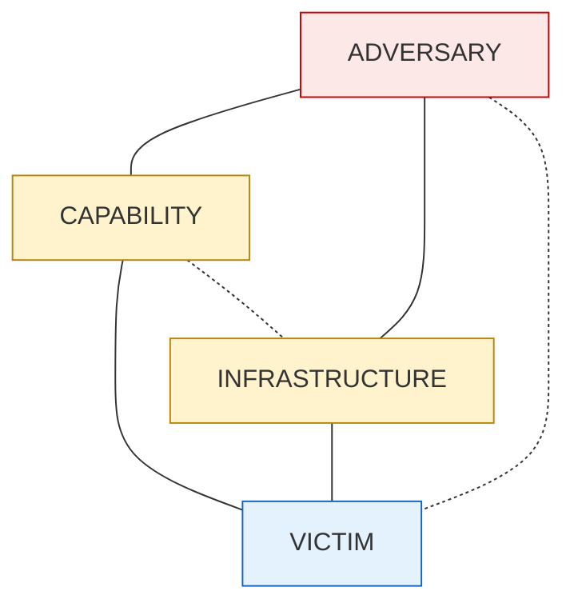
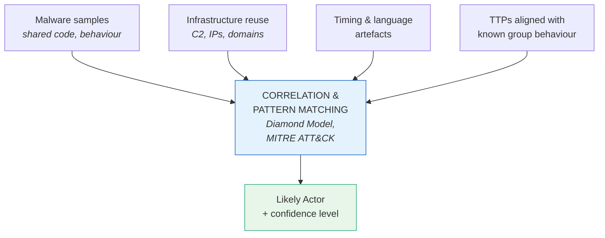

# Module 1 — Introduction to Threat Intelligence

## Welcome

> *Ever wonder how hackers always seem one step ahead?*

In the world of cyber threats, recognising patterns and predicting the next move is a skill — and this module is where you start learning to do exactly that.

Many professionals feel overwhelmed by the noise: so much data, but not enough intelligence. This module helps you transform raw, scattered data into meaningful insight using proven frameworks and analysis techniques.

This is where your journey begins. We'll break down the threat landscape, walk through modelling frameworks, and talk ethics and attribution — so you can think like a true intelligence analyst.

---

## From Noise to Insight



This is the core problem the module solves: most analysts have plenty of data; what they need is the discipline to turn it into intelligence.

---

## Module Pillars

The module is built on three pillars:



---

## Learning Outcomes

By the end of this module, you will be able to:

1. **Differentiate** between types of threat actors based on their motivations and capabilities.
2. **Compare** popular threat modelling frameworks — **MITRE ATT&CK**, the **Diamond Model**, and the **Cyber Kill Chain**.
3. **Evaluate** the ethical and legal challenges involved in intelligence collection.
4. **Apply** attribution techniques to real-world threat actor scenarios.

---

## Threat Modelling Frameworks at a Glance

You'll work with three complementary frameworks. Each looks at adversary activity from a different angle.

```
   FRAMEWORK              LENS                       BEST FOR
   ─────────              ────                       ────────

   MITRE ATT&CK           Tactics, Techniques,       Mapping observed
                          and Procedures (TTPs)      adversary behaviour
                                                     to known patterns

   Diamond Model          Adversary ↔ Capability     Multidimensional
                          ↕              ↕            analysis of a
                          Infrastructure ↔ Victim    single intrusion

   Cyber Kill Chain       Linear stages of an        Tracking where in
                          attack (recon → actions    the attack lifecycle
                          on objectives)             a threat sits
```

The **Diamond Model** in particular shows how four nodes interact in any intrusion:



---

## Tools & Frameworks Used in This Module

```
   PURPOSE                              TOOL / FRAMEWORK
   ───────                              ────────────────

   Mapping threat actor TTPs    ───▶    MITRE ATT&CK
   Multidimensional analysis    ───▶    Diamond Model
   Attack lifecycle tracking    ───▶    Cyber Kill Chain
   Ethical & legal guardrails   ───▶    GDPR, NIST
```

---

## Lesson 1 — Threat Actor Types and Attribution

> *Have you ever wondered who is really behind cyber attacks? It's not always a hooded figure in a basement. Sometimes it's a well-funded nation state, and sometimes it's just a bored teenager with skills.*

This lesson analyses the different types of threat actors, explores their motivations, evaluates their capabilities, and introduces basic attribution methodologies for understanding who might be targeting your organisation and why.

### Lesson Outcomes

By the end of this lesson you will be able to:

1. **Categorise** the four main types of threat actor.
2. **Differentiate** their motivations and operational capabilities.
3. **Apply** basic attribution methodologies to real-world scenarios.
4. **Assign** confidence levels to attribution assessments.

### The Four Main Threat Actor Types

```
   ┌────────────────┬──────────────────┬──────────────────┬────────────────────┐
   │   ACTOR        │   MOTIVATION     │   CAPABILITIES   │   EXAMPLE          │
   ├────────────────┼──────────────────┼──────────────────┼────────────────────┤
   │ Nation State   │ Geopolitical:    │ Highly resourced,│ APT29 / Cozy Bear  │
   │                │ espionage,       │ patient, precise │ (Russia-linked) —  │
   │                │ disruption,      │ — strategic,     │ targets diplomatic │
   │                │ destabilisation  │ long-term        │ & research orgs    │
   ├────────────────┼──────────────────┼──────────────────┼────────────────────┤
   │ Cybercriminal  │ Profit:          │ Quick,           │ LockBit, BlackCat  │
   │                │ ransomware,      │ opportunistic,   │ — Ransomware-as-a- │
   │                │ stolen cards,    │ loosely          │ Service gangs;     │
   │                │ access sales     │ affiliated       │ target = anyone    │
   │                │                  │                  │ who can pay        │
   ├────────────────┼──────────────────┼──────────────────┼────────────────────┤
   │ Hacktivist     │ Ideology:        │ Decentralised,   │ Anonymous —        │
   │                │ political /      │ unpredictable,   │ tricky to          │
   │                │ social protest,  │ media-driven     │ attribute due to   │
   │                │ "send a message" │                  │ loose structure    │
   ├────────────────┼──────────────────┼──────────────────┼────────────────────┤
   │ Insider        │ Revenge,         │ Already have     │ Disgruntled        │
   │                │ negligence,      │ legitimate       │ employee leaking   │
   │                │ accidental       │ access — among   │ data; staff member │
   │                │ vulnerability    │ the most         │ ignoring policy    │
   │                │                  │ dangerous        │                    │
   └────────────────┴──────────────────┴──────────────────┴────────────────────┘
```

### Attribution Methodologies

Once you've identified **what kind** of actor you're dealing with, the next challenge is attribution — figuring out **who** is behind the attack. Attribution is rarely about finding a face and a name; it's about correlating evidence to assess the likely actor.



### Confidence Levels

Attribution is **rarely 100% certain**. Analysts use frameworks like the **Diamond Model** and **MITRE ATT&CK** to evaluate signals and then assign a confidence level to their conclusions.

```
   CONFIDENCE   │  WHEN TO USE IT
   ─────────────┼─────────────────────────────────────────────
   HIGH         │  Multiple, independent, corroborating
                │  pieces of evidence point to the same actor
   ─────────────┼─────────────────────────────────────────────
   MODERATE     │  Strong indicators but gaps remain or
                │  some evidence is circumstantial
   ─────────────┼─────────────────────────────────────────────
   LOW          │  Limited evidence; assessment is plausible
                │  but easily challenged
```

### Lesson Recap

- The four main threat actor types are **nation states**, **cybercriminals**, **hacktivists**, and **insiders**.
- Each has distinct motivations and capabilities — from geopolitical patience to opportunistic profit to ideological signalling to insider access.
- Attribution rests on correlating evidence: malware, infrastructure reuse, timing, language artefacts, and TTPs.
- Analytical rigour is what turns signals into well-supported judgements about who is behind a threat and why.
- Conclusions should always be qualified with a confidence level: **high**, **moderate**, or **low**.

> **Coming next:** comparing and contrasting threat modelling frameworks — MITRE ATT&CK, the Diamond Model, the Cyber Kill Chain, **STRIDE**, and **PASTA** — to help structure your threat analysis approach.

---

## Why This Module Matters

This isn't just theory — it is the foundation for everything that follows in the course. Without a clear grasp of who the threat actors are, how their behaviour can be modelled, and what is ethically and legally permissible when collecting intelligence, the more advanced techniques in later modules will not stand up to scrutiny.

> Build the skills to **think like an analyst** and **lead like a strategist**.
